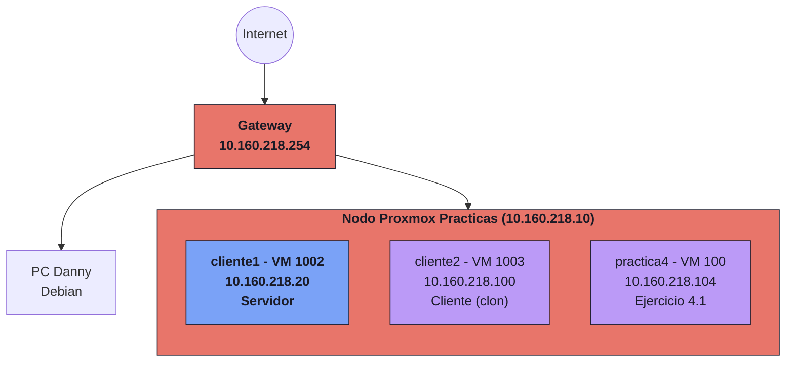
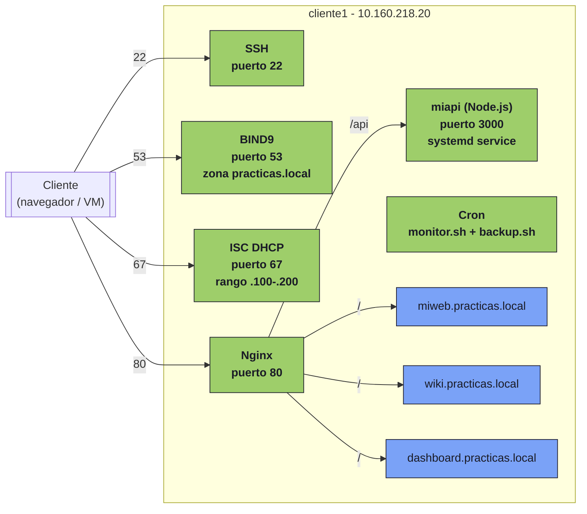
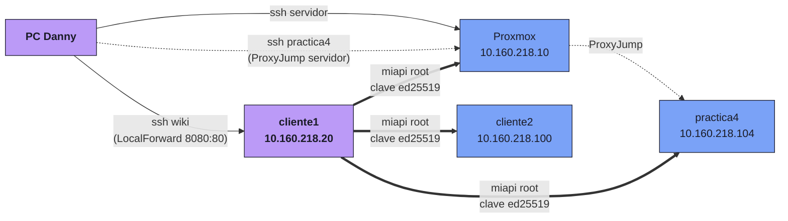

# Arquitectura del laboratorio

Vista general de la infraestructura montada durante las prácticas: máquinas, servicios y flujos de conexión.

## Topología física

Esquema de red del laboratorio, con el PC de Danny, el hipervisor Proxmox y las VMs que corren dentro.

| Componente | IP | Rol |
|------------|----|----|
| Gateway | 10.160.218.254 | Puerta de enlace de la red de prácticas |
| PC Danny | DHCP | Equipo de trabajo, accede por SSH al laboratorio |
| Proxmox Practicas | 10.160.218.10 | Hipervisor Proxmox VE 8.4.17 |
| cliente1 | 10.160.218.20 | VM Debian 13 - servidor (estática) |
| cliente2 | 10.160.218.100 | VM Debian 13 - cliente (DHCP) |
| practica4 | 10.160.218.104 | VM Debian 13 - ejercicio 4.1 (DHCP) |

## Servicios en cliente1

`cliente1` es el corazón del laboratorio: aloja el servidor web, DNS, DHCP y la API del dashboard.

| Servicio | Puerto | Función |
|----------|--------|---------|
| Nginx | 80 | 3 sitios virtuales + reverse proxy `/api` → 3000 |
| BIND9 | 53 | Servidor DNS autoritativo de la zona `practicas.local` |
| ISC DHCP | 67 | Asignación dinámica de IPs en rango `.100-.200` |
| miapi (Node.js) | 3000 | API del dashboard, servicio systemd `Restart=always` |
| SSH | 22 | Acceso remoto por clave pública |
| Cron | - | `monitor.sh` y `backup-disk-usage.sh` cada hora |

## Flujos SSH

Dos tipos de conexiones por SSH: desde el PC de Danny hacia el laboratorio, y desde `cliente1` hacia las otras máquinas para alimentar el dashboard multi-host.

**Flechas sólidas (`-->`)**: conexiones desde el PC de Danny configuradas en `~/.ssh/config`.

**Flechas gruesas (`==>`)**: conexiones que hace el proceso `miapi` (como `root` en cliente1) para recoger métricas de las otras máquinas en el selector multi-host del dashboard.

**Flechas de puntos (`-.->`)**: salto de ProxyJump (cliente1 como intermediario para llegar a practica4).

| Alias | Destino | Notas |
|-------|---------|-------|
| `ssh servidor` | `soltecsis@10.160.218.10` | Acceso al hipervisor Proxmox |
| `ssh wiki` | `soltecsis@10.160.218.20` | cliente1, con `LocalForward 8080:80` para la wiki |
| `ssh practica4` | `danbol@10.160.218.104` | VM del ejercicio 4.1, usando Proxmox como ProxyJump |

!!! tip "Plan de crecimiento"
    Si en algún momento hace falta una tercera VM para pruebas aisladas, el nombre reservado es `matrix` (10.160.218.42). De momento solo vive como entrada comentada en `/etc/hosts`.
