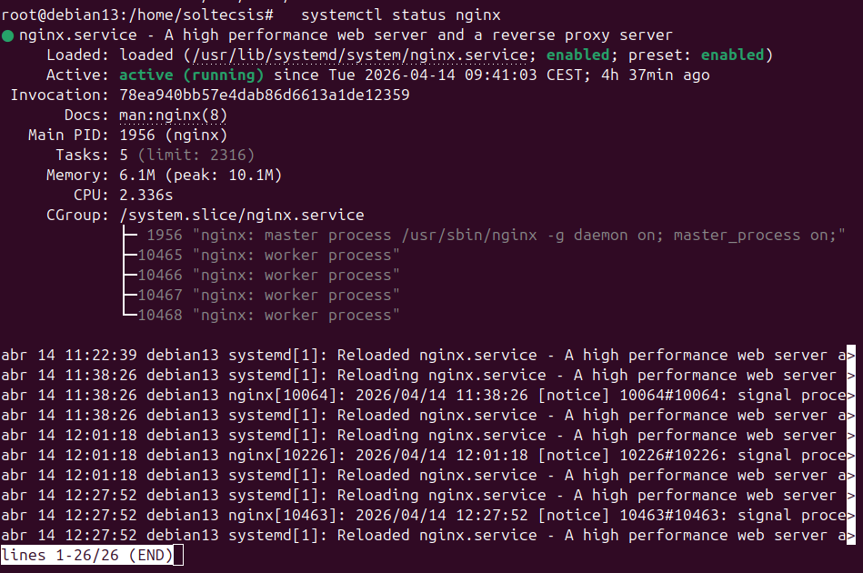
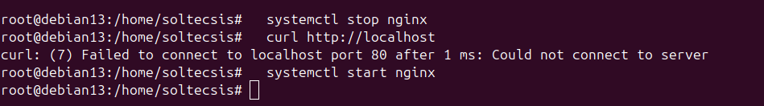
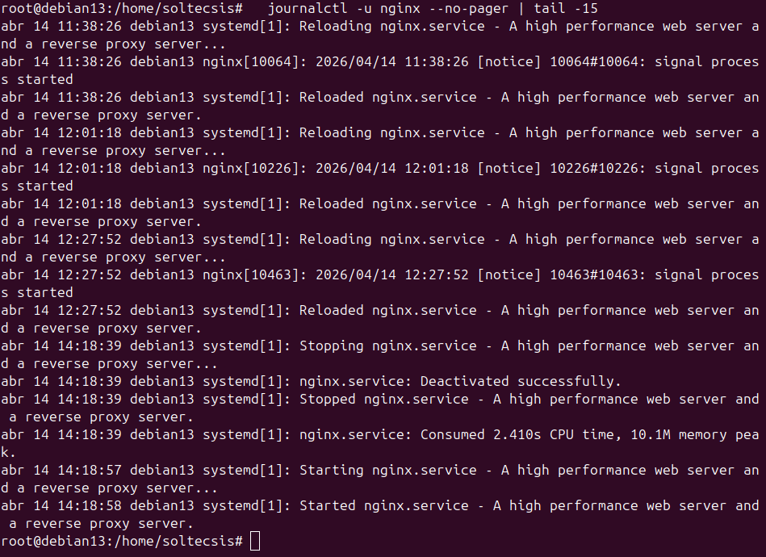

# Ejercicio 1.2 - Procesos y servicios

## Objetivo
Instalar Nginx, gestiónar el servicio con systemctl y consultar los logs.

## Gestión de paquetes con apt

Antes de instalar, se actualiza la lista de paquetes disponibles:

```bash
sudo apt update          # Actualizar lista de paquetes
sudo apt search nginx    # Buscar paquetes que contengan "nginx"
sudo apt show nginx      # Ver info detallada de un paquete
dpkg -l | grep nginx     # Ver paquetes instalados que contengan "nginx"
```

| Comando | Para que sirve |
|---------|---------------|
| `apt update` | Descarga la lista actualizada de paquetes disponibles |
| `apt install` | Instala un paquete |
| `apt search` | Busca paquetes por nombre o descripción |
| `apt show` | Muestra detalles de un paquete (version, dependencias) |
| `dpkg -l` | Lista todos los paquetes instalados en el sistema |

## Instalación

Instalar Nginx:
```bash
sudo apt update && sudo apt install -y nginx
```

Verificar que esta corriendo:
```bash
$ systemctl status nginx
● nginx.service - A high performance web server and a reverse proxy server
     Loaded: loaded (/usr/lib/systemd/system/nginx.service; enabled; preset: enabled)
     Active: active (running) since Mon 2026-03-30 08:42:56 CEST

$ ps aux | grep nginx
root        7187  0.0  0.0  11208  7120 ?        S    08:42   0:00 nginx: master process
www-data    7189  0.0  0.0  12952  4668 ?        S    08:42   0:00 nginx: worker process
```

Parar el servicio y comprobar que no responde:
```bash
$ sudo systemctl stop nginx

$ systemctl status nginx
     Active: inactive (dead) since Mon 2026-03-30 08:45:59 CEST

$ curl http://localhost
curl: (7) Failed to connect to localhost port 80 after 0 ms: Couldn't connect to server
```

Arrancar y habilitar inicio automático:
```bash
$ sudo systemctl start nginx
$ sudo systemctl enable nginx

$ systemctl is-enabled nginx
enabled
```

## Gestión de procesos

Ver los procesos de Nginx y su uso de recursos:

```bash
# Ver procesos en tiempo real (interactivo)
htop

# Buscar el PID de un proceso
pidof nginx

# Matar un proceso por PID (solo en caso de emergencia)
kill -9 <PID>
```

| Señal | Comando | Descripción |
|-------|---------|-------------|
| SIGTERM (15) | `kill PID` | Pide al proceso que termine limpiamente |
| SIGKILL (9) | `kill -9 PID` | Fuerza la terminacion inmediata (último recurso) |
| SIGHUP (1) | `kill -1 PID` | Recarga la configuración sin reiniciar |

!!! warning "Matar procesos"
    Usar `kill -9` solo como último recurso. Para servicios gestiónados por systemd, siempre es mejor usar `systemctl stop/restart`.

## Logs

Consultar logs:
```bash
$ sudo journalctl -u nginx --since today
mar 30 08:42:56 danny systemd[1]: Started nginx.service
mar 30 08:45:59 danny systemd[1]: Stopping nginx.service
mar 30 08:45:59 danny systemd[1]: Stopped nginx.service
mar 30 08:47:12 danny systemd[1]: Started nginx.service
```

Opciones útiles de journalctl:

| Opción | Descripción |
|--------|-------------|
| `-u nginx` | Filtrar por servicio |
| `--since today` | Solo logs de hoy |
| `-f` | Seguir en tiempo real (como tail -f) |
| `-n 50` | Mostrar las últimas 50 líneas |

## Capturas







## Resultado
- Nginx se instaló correctamente
- Se verificó que el servicio se puede parar y arrancar con systemctl
- Al pararlo, el puerto 80 deja de responder
- Esta configurado para arrancar automáticamente al inicio (enabled)
- Los logs muestran el historial de arranques y paradas del servicio
