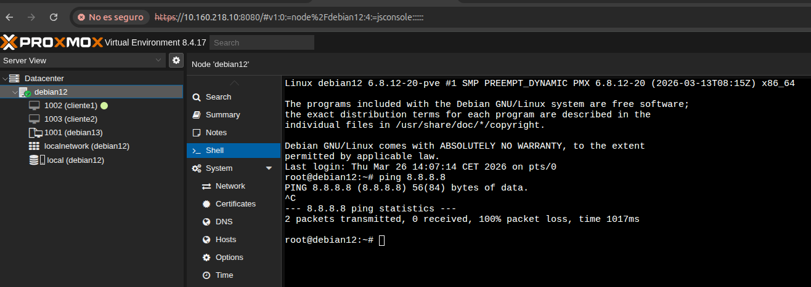
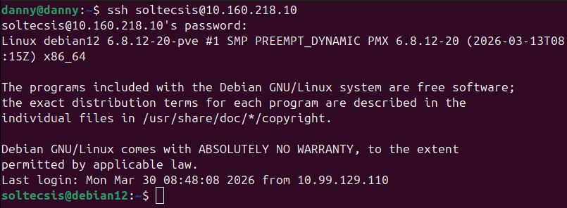

# Ejercicio 2.1 - Instalacion de Debian 12 en Proxmox

## Objetivo
Instalar un servidor Debian 12 en Proxmox con acceso SSH funcional.

## Datos del entorno

- **Proxmox VE:** 8.4.17
- **Nodo:** debian12
- **URL panel:** https://10.160.218.10:8080
- **VMs creadas:**
  - 1001 (debian13)
  - 1002 (cliente1)
  - 1003 (cliente2)
- **Red:** localnetwork (debian12)

## Servidor de practicas

- **SO:** Debian 12 (kernel 6.8.12-20-pve)
- **IP:** 10.160.218.10
- **Usuario:** soltecsis
- **Acceso SSH:** funcional

## Capturas

## Estado
- Servidor Debian 12 instalado y operativo
- Acceso SSH verificado
- Sin acceso a internet (pendiente de habilitar puertos DNS)
