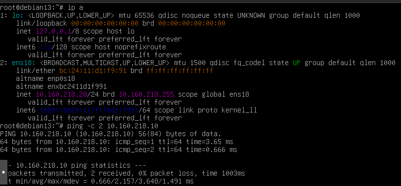

# Ejercicio 2.2 - Configuración de red

## Objetivo
Configurar IP estática en la VM cliente1, verificar conectividad y resolver DNS.

## Conceptos de red

| Concepto | Descripción |
|----------|-------------|
| IP estática | Dirección fija asignada manualmente (no cambia al reiniciar) |
| CIDR /24 | Mascara 255.255.255.0 — permite 254 hosts en la red |
| Gateway | Puerta de enlace — envia el tráfico fuera de la red local |
| DNS | Servidor que traduce nombres de dominio a direcciones IP |

## Datos de red

| Equipo | IP | Rol |
|--------|----|-----|
| Nodo Proxmox | 10.160.218.10 | Hipervisor |
| cliente1 (VM) | 10.160.218.20 | Servidor de prácticas |
| Gateway | 10.160.218.254 | Puerta de enlace |

## Comandos

Ver estado inicial de la red (sin configurar):
```bash
ip a
ip route
cat /etc/network/interfaces
```

La interfaz ens18 estaba en estado DOWN y sin IP asignada.

Configurar IP estática editando /etc/network/interfaces:
```
auto ens18
iface ens18 inet static
    address 10.160.218.20/24
    gateway 10.160.218.254
    dns-nameservers 8.8.8.8 8.8.4.4
```

Levantar la interfaz:
```bash
ifup ens18
```

## Verificación

```bash
$ ip a show ens18
2: ens18: <BROADCAST,MULTICAST,UP,LOWER_UP> mtu 1500 qdisc fq_codel state UP
    inet 10.160.218.20/24 brd 10.160.218.255 scope global ens18

$ ping -c 2 10.160.218.10
2 packets transmitted, 2 received, 0% packet loss, time 1003ms
rtt min/avg/max/mdev = 0.666/2.157/3.648/1.491 ms
```

## Herramientas de diagnóstico

Comandos útiles para comprobar la red:

```bash
# Ver interfaces y sus IPs
ip a

# Ver tabla de rutas (gateway configurado)
ip route

# Ver puertos abiertos y servicios escuchando
ss -tulnp

# Comprobar conectividad con otro equipo
ping -c 4 10.160.218.10

# Trazar la ruta que siguen los paquetes
traceroute 10.160.218.10

# Consultar DNS (si hay servidor DNS disponible)
dig practicas.local
nslookup practicas.local
```

| Comando | Para que sirve |
|---------|---------------|
| `ip a` | Ver direcciones IP de todas las interfaces |
| `ip route` | Ver la tabla de enrutamiento y el gateway |
| `ss -tulnp` | Ver que puertos estan abiertos y que proceso los usa |
| `ping` | Comprobar si hay conectividad con otro equipo |
| `traceroute` | Ver por donde pasan los paquetes hasta el destino |

## Capturas



## Resultado
- IP estática 10.160.218.20/24 configurada correctamente en ens18
- Conectividad con el nodo Proxmox (10.160.218.10) verificada
- Sin acceso a internet en el momento del ejercicio (resuelto posteriormente con entradas en /etc/hosts)
