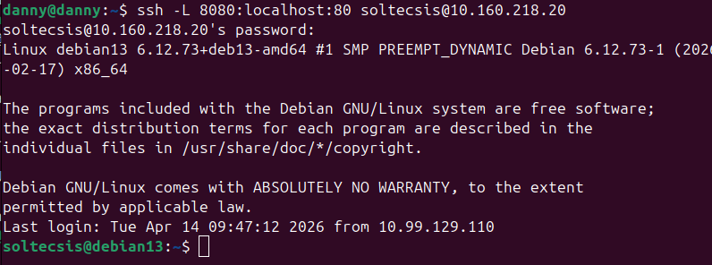
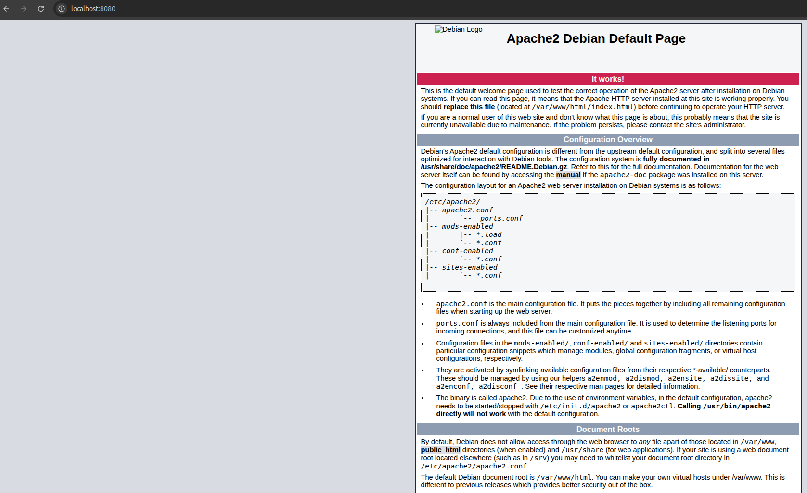

# Ejercicio 2.3 - SSH en profundidad

## Objetivo
Configurar SSH con clave publica, deshabilitar root login y securizar el acceso.

## Comandos

### Crear clave SSH (desde PC local)
```bash
ssh-keygen -t ed25519 -C "danny@zataca"
```

### Copiar clave al servidor
```bash
ssh-copy-id soltecsis@10.160.218.10
```

### Configurar ~/.ssh/config (PC local)
```
Host servidor
    HostName 10.160.218.10
    User soltecsis
    IdentityFile ~/.ssh/id_ed25519
```

Ahora se puede conectar con solo:
```bash
ssh servidor
```

### Securizar SSH en el servidor (/etc/ssh/sshd_config)

Cambios realizados:
```
PermitRootLogin no
PasswordAuthentication no
MaxAuthTries 3
```

Reiniciar el servicio:
```bash
sudo systemctl restart sshd
```

### Verificacion
- Conexion con `ssh servidor` funciona sin contraseña (clave publica)
- Root no puede hacer login por SSH
- Solo se permiten 3 intentos de autenticacion
- Contraseña deshabilitada, solo clave publica

### Tuneles SSH

#### Tunel local (Local Forward)
Acceder al Nginx del servidor (puerto 80) desde el PC local en el puerto 8080:

```bash
ssh -L 8080:localhost:80 soltecsis@10.160.218.20
```

Esto redirige `localhost:8080` en el PC local al puerto 80 del servidor a traves del tunel SSH.

#### Verificacion
Tras ejecutar el comando, se accede a `http://localhost:8080` en el navegador y se ve la pagina web del servidor:





#### Tunel remoto (Remote Forward)
Permite exponer un servicio local en el servidor remoto:

```bash
ssh -R 9090:localhost:3000 soltecsis@10.160.218.20
```

Esto haria accesible el puerto 3000 del PC local como puerto 9090 en el servidor.

## Resultado
- Clave SSH ed25519 creada y copiada al servidor
- Acceso rapido configurado con ~/.ssh/config
- Servidor SSH securizado: sin root, sin contraseña, max 3 intentos
- Tunel local SSH funcionando: acceso a Nginx remoto via localhost:8080
