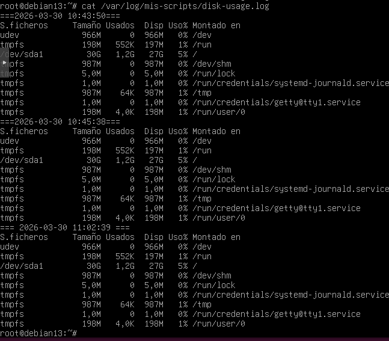
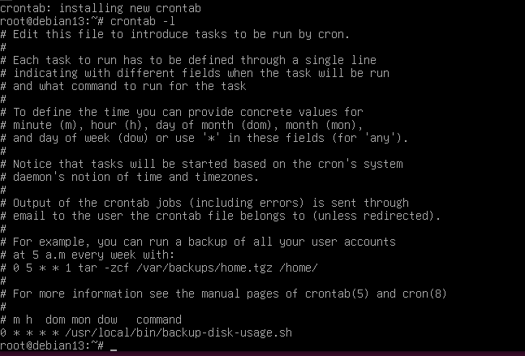

# Ejercicio 2.4 - Cron y tareas programadas

## Objetivo
Crear un script que registre el uso de disco y programarlo con cron para que se ejecute cada hora.

## Sintaxis de crontab

Cada línea de crontab sigue este formato de 5 campos + comando:

```
┌───────── minuto (0-59)
│ ┌─────── hora (0-23)
│ │ ┌───── dia del mes (1-31)
│ │ │ ┌─── mes (1-12)
│ │ │ │ ┌─ dia de la semana (0-7, 0 y 7 = domingo)
│ │ │ │ │
* * * * * comando
```

| Ejemplo | Significado |
|---------|-------------|
| `0 * * * *` | Cada hora en punto |
| `*/5 * * * *` | Cada 5 minutos |
| `0 2 * * *` | Cada dia a las 2:00 |
| `0 0 * * 0` | Cada domingo a medianoche |
| `30 8 1 * *` | El dia 1 de cada mes a las 8:30 |

## Script: backup-disk-usage.sh

Ubicación: /usr/local/bin/backup-disk-usage.sh

```bash
#!/bin/bash
FECHA=$(date "+%Y-%m-%d %H:%M:%S")
LOG=/var/log/mis-scripts/disk-usage.log
echo "=== $FECHA ===" >> $LOG
df -h >> $LOG
```

## Comandos

Crear directorio de logs:
```bash
mkdir -p /var/log/mis-scripts
```

Dar permisos de ejecución:
```bash
chmod +x /usr/local/bin/backup-disk-usage.sh
```

Ejecutar manualmente para verificar:
```bash
/usr/local/bin/backup-disk-usage.sh
cat /var/log/mis-scripts/disk-usage.log
```

Programar con cron (cada hora en punto):
```bash
crontab -e
# Añadir la línea:
0 * * * * /usr/local/bin/backup-disk-usage.sh
```

Verificar crontab:
```bash
crontab -l
```

## Verificar ejecución en syslog

Cron registra cada ejecución en el syslog del sistema:

```bash
grep CRON /var/log/syslog | tail -5
```

Ejemplo de salida:
```
Apr 14 12:00:01 cliente1 CRON[1234]: (soltecsis) CMD (/usr/local/bin/backup-disk-usage.sh)
```

Si el script no aparece en syslog, puede ser que cron no este activo (`systemctl status cron`) o que haya un error de permisos en el script.

!!! tip "Alternativa: systemd timers"
    En sistemas modernos con systemd, se pueden usar **timers** en vez de cron. La ventaja es que se integran con `journalctl` para ver los logs. En este ejercicio usamos cron por ser más sencillo y universal.

## Capturas





## Resultado
- Script creado en el servidor cliente1 (10.160.218.20)
- Registra fecha y uso de disco en /var/log/mis-scripts/disk-usage.log
- Programado con cron para ejecutarse cada hora en punto (`0 * * * *`)
- Se puede verificar la ejecución con `grep CRON /var/log/syslog`

!!! tip "Crontab de los viernes"
    Un clásico de oficina: `0 17 * * 5 echo "beer time"`. A las 17:00 de cada viernes el sysadmin oye *ping*. La pregunta filosófica es si el servidor también celebra.
