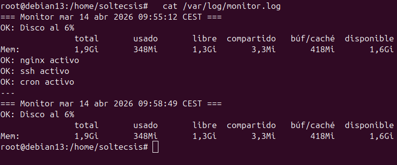
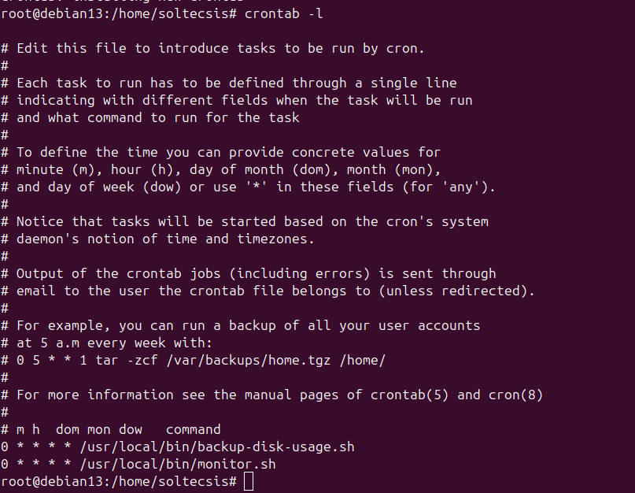

# Ejercicio 2.4 - Script de monitorización básica

## Objetivo
Crear un script que monitorice disco, memoria y servicios del servidor, y programarlo con cron.

## Prerequisitos
- Servidor con Nginx, SSH y Cron instalados
- Acceso root al servidor

## Script monitor.sh

Ubicación en el servidor: `/usr/local/bin/monitor.sh`

```bash
#!/bin/bash
set -euo pipefail

LOG="/var/log/monitor.log"
UMBRAL_DISCO=80

echo "=== Monitor $(date) ===" >> "$LOG"

# Disco
USO_DISCO=$(df / | tail -1 | awk '{print $5}' | tr -d '%')
if [ "$USO_DISCO" -gt "$UMBRAL_DISCO" ]; then
    echo "ALERTA: Disco al ${USO_DISCO}%" >> "$LOG"
else
    echo "OK: Disco al ${USO_DISCO}%" >> "$LOG"
fi

# Memoria
free -h | head -2 >> "$LOG"

# Servicios
for svc in nginx ssh cron; do
    if systemctl is-active --quiet "$svc"; then
        echo "OK: $svc activo" >> "$LOG"
    else
        echo "ALERTA: $svc caido" >> "$LOG"
    fi
done

echo "---" >> "$LOG"
```

### Que hace el script
1. Comprueba el uso de disco de `/` y alerta si supera el 80%
2. Registra el uso de memoria RAM
3. Comprueba si los servicios nginx, ssh y cron estan activos
4. Escribe todo en `/var/log/monitor.log`

### Instalación
```bash
cp monitor.sh /usr/local/bin/monitor.sh
chmod +x /usr/local/bin/monitor.sh
```

## Ejecución y resultado

Ejecución manual del script y resultado en el log:



- Disco al 6% (por debajo del umbral de 80%)
- 1,9Gi de RAM total, 1,3Gi libre
- Servicios nginx, ssh y cron activos

## Programacion con cron

Se programa para ejecutarse cada hora:

```bash
crontab -e
# Añadir:
0 * * * * /usr/local/bin/monitor.sh
```

Crontab configurado con las dos tareas (backup-disk-usage.sh y monitor.sh):



## Resultado
- Script monitor.sh creado y funcionando
- Monitoriza disco, RAM y servicios (nginx, ssh, cron)
- Programado con cron para ejecutarse cada hora
- Logs en /var/log/monitor.log

!!! quote "Filosofía del monitor"
    *"Un servidor feliz es un servidor bien monitorizado."*  
    — fortune cookie de sysadmin
