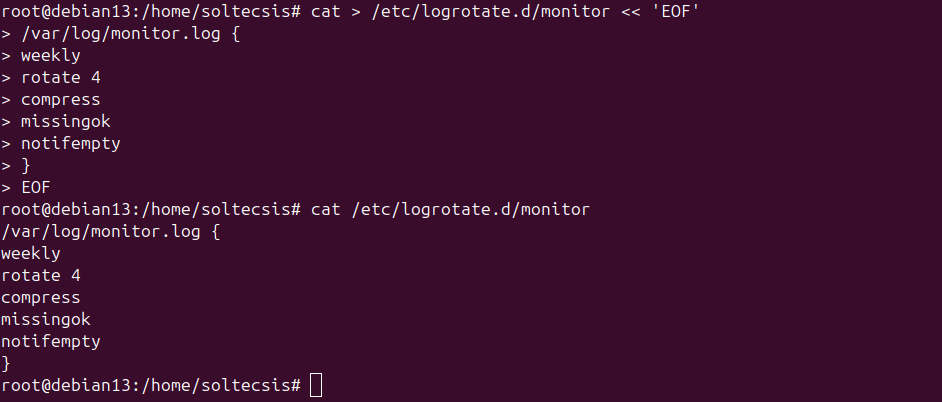

# Ejercicio 2.5 - Análisis de logs

## Objetivo
Revisar logs del sistema para encontrar intentos de login fallidos, errores en Nginx y configurar logrotate.

## Estructura de logs en Linux

| Fichero | Contenido |
|---------|-----------|
| /var/log/syslog | Log general del sistema |
| /var/log/auth.log | Intentos de login |
| /var/log/kern.log | Kernel |
| /var/log/nginx/ | Logs de Nginx |
| /var/log/apt/ | Logs de apt |

## 1. Análisis de auth.log - Intentos de login fallidos

Se simularon 3 intentos de login SSH con un usuario inexistente ("ana") para generar entradas en el log:

```bash
# Desde el PC local:
ssh ana@10.160.218.20
# (contraseña incorrecta x3)
```

Buscar intentos fallidos en el servidor:

```bash
grep "Failed" /var/log/auth.log
```

Resultado: 3 intentos fallidos detectados desde la IP 10.99.129.110, usuario invalido "ana", protocolo ssh2.

## 2. Análisis de logs de Nginx - Errores 404

Buscar errores 404 en los logs de acceso de Nginx:

```bash
cat /var/log/nginx/access.log | grep "404"
```

Resultado: Se encontraron peticiones 404 para `/icons/openlogo-75.png` y `/favicon.ico` (recursos que no existen en el servidor).


### Herramientas útiles para análisis de logs

```bash
# Seguir logs en tiempo real
tail -f /var/log/syslog

# Buscar errores
grep "error" /var/log/syslog

# Logs de systemd
journalctl -u nginx --since today

# Contar intentos fallidos
grep -c "Failed" /var/log/auth.log
```

## 3. Configurar logrotate

Se configuro logrotate para el fichero de log del script monitor.sh:

```bash
cat > /etc/logrotate.d/monitor << 'EOF'
/var/log/monitor.log {
    weekly
    rotate 4
    compress
    missingok
    notifempty
}
EOF
```

| Parámetro | Función |
|-----------|---------|
| weekly | Rota el log una vez por semana |
| rotate 4 | Mantiene las ultimas 4 copias |
| compress | Comprime los logs rotados con gzip |
| missingok | No da error si el fichero no existe |
| notifempty | No rota si el fichero esta vacio |



## Resultado
- Detectados intentos de login fallidos en auth.log (usuario "ana", 3 intentos)
- Encontrados errores 404 en los logs de Nginx
- Logrotate configurado para /var/log/monitor.log (rotación semanal, 4 copias, comprimido)
