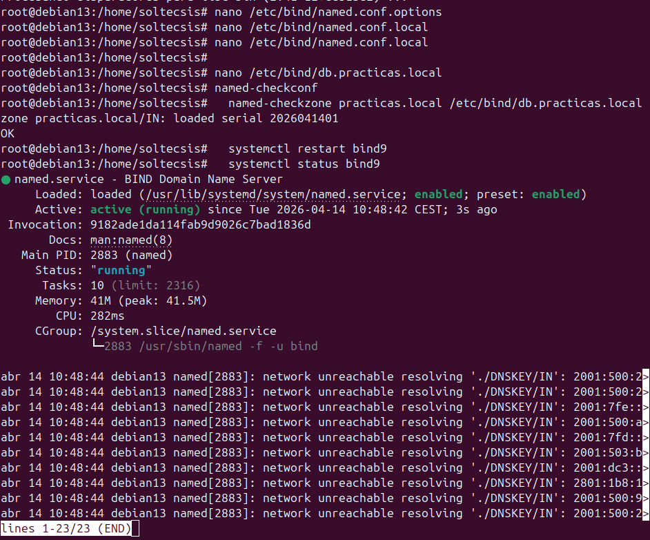
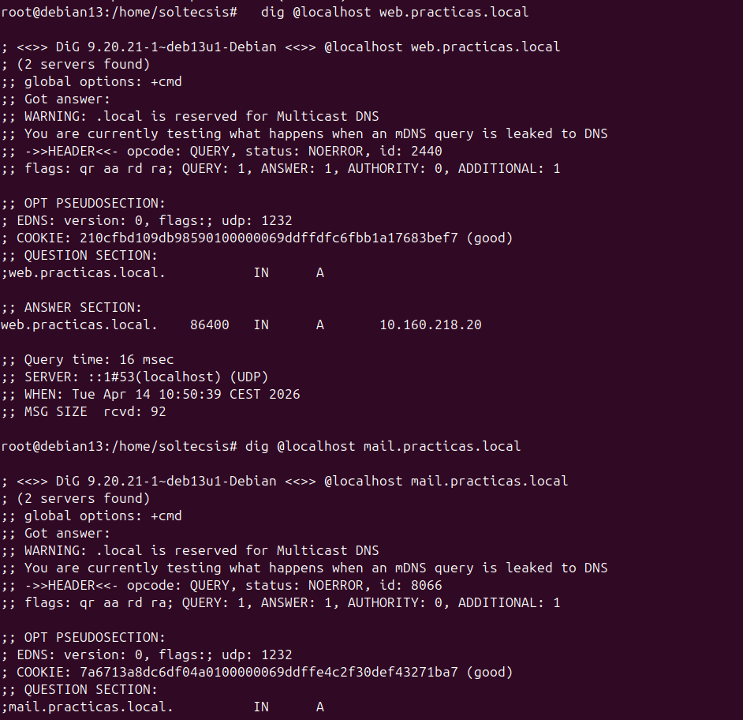

# Ejercicio 3.2 - Servidor DNS con BIND9

## Objetivo
Instalar BIND9, crear una zona directa para "practicas.local" y verificar con dig.

## Instalacion

```bash
apt install -y bind9 bind9-utils dnsutils
```

## Configuracion

### 1. Opciones generales (/etc/bind/named.conf.options)

```
options {
    directory "/var/cache/bind";
    forwarders {
        8.8.8.8;
        8.8.4.4;
    };
    listen-on { any; };
    allow-query { any; };
};
```

- **forwarders:** Consultas que BIND no puede resolver las reenvia a Google DNS
- **listen-on { any }:** Escucha en todas las interfaces
- **allow-query { any }:** Permite consultas desde cualquier IP

### 2. Zona local (/etc/bind/named.conf.local)

```
zone "practicas.local" {
    type master;
    file "/etc/bind/db.practicas.local";
};
```

### 3. Fichero de zona (/etc/bind/db.practicas.local)

```
$TTL 86400
@   IN  SOA ns1.practicas.local. admin.practicas.local. (
        2026041401  ; Serial
        3600        ; Refresh
        900         ; Retry
        604800      ; Expire
        86400       ; Minimum TTL
)
@       IN  NS  ns1.practicas.local.
ns1     IN  A   10.160.218.20
web     IN  A   10.160.218.20
db      IN  A   10.160.218.20
mail    IN  A   10.160.218.20
```

#### Tipos de registro DNS
| Tipo | Funcion |
|------|---------|
| SOA | Start of Authority - informacion de la zona |
| NS | Name Server - servidor DNS autoritativo |
| A | Asocia nombre a IPv4 |
| AAAA | Asocia nombre a IPv6 |
| CNAME | Alias de otro nombre |
| MX | Servidor de correo |

## Verificacion

### Comprobar configuracion
```bash
named-checkconf
named-checkzone practicas.local /etc/bind/db.practicas.local
```

Resultado: zona cargada correctamente (serial 2026041401, OK).

### Arrancar servicio
```bash
systemctl restart bind9
systemctl status bind9
```



### Comprobar resolucion con dig
```bash
dig @localhost web.practicas.local
dig @localhost mail.practicas.local
```

Ambos registros resuelven correctamente a 10.160.218.20:



## Resultado
- BIND9 instalado y funcionando como servidor DNS
- Zona "practicas.local" creada con registros A para web, db, mail y ns1
- Verificado con dig: todos los registros resuelven a 10.160.218.20
