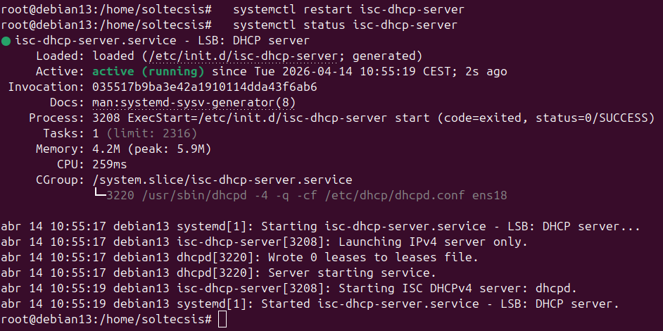
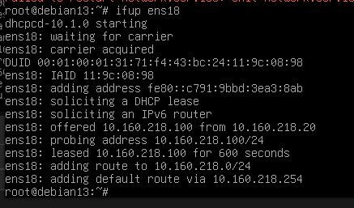
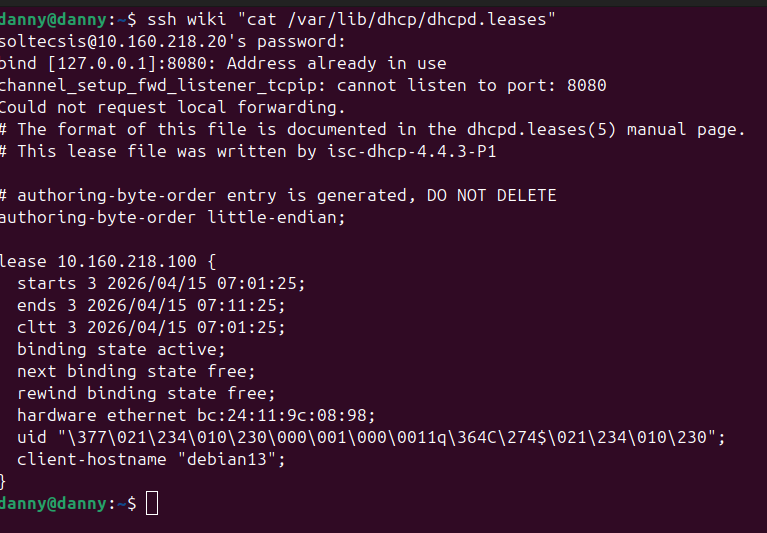

# Ejercicio 3.3 - Servidor DHCP

## Objetivo
Instalar y configurar ISC DHCP Server para asignar IPs automáticamente a los clientes de la red.

## Como funciona DHCP

DHCP (Dynamic Host Configuration Protocol) asigna IPs automáticamente a los clientes de la red. El proceso se llama **DORA**:

```
Cliente                          Servidor DHCP
   │                                  │
   │── 1. DISCOVER (broadcast) ──────>│  "¿Hay algun servidor DHCP?"
   │                                  │
   │<──── 2. OFFER ──────────────────│  "Te ofrezco la IP 10.160.218.100"
   │                                  │
   │── 3. REQUEST ───────────────────>│  "Acepto esa IP"
   │                                  │
   │<──── 4. ACK ────────────────────│  "Confirmado, es tuya por 600 segundos"
   │                                  │
```

| Paso | Nombre | Descripción |
|------|--------|-------------|
| 1 | **D**iscover | El cliente busca servidores DHCP en la red (broadcast) |
| 2 | **O**ffer | El servidor ofrece una IP disponible del rango |
| 3 | **R**equest | El cliente acepta la oferta |
| 4 | **A**ck | El servidor confirma y asigna la IP con un tiempo de concesión (lease) |

## Instalación

```bash
apt install -y isc-dhcp-server
```

## Configuración

### 1. Interfaz de escucha (/etc/default/isc-dhcp-server)

```
INTERFACESv4="ens18"
```

### 2. Configuración DHCP (/etc/dhcp/dhcpd.conf)

```
subnet 10.160.218.0 netmask 255.255.255.0 {
    range 10.160.218.100 10.160.218.200;
    option routers 10.160.218.254;
    option domain-name-servers 10.160.218.20;
    option domain-name "practicas.local";
    default-lease-time 600;
    max-lease-time 7200;
}
```

| Parámetro | Valor | Descripción |
|-----------|-------|-------------|
| range | 10.160.218.100 - 200 | Rango de IPs que asigna (101 direcciones) |
| routers | 10.160.218.254 | Gateway por defecto |
| domain-name-servers | 10.160.218.20 | Servidor DNS (nuestro BIND9) |
| domain-name | practicas.local | Dominio de búsqueda |
| default-lease-time | 600 | Tiempo de concesión por defecto (10 min) |
| max-lease-time | 7200 | Tiempo máximo de concesión (2 horas) |

## Verificación

```bash
systemctl restart isc-dhcp-server
systemctl status isc-dhcp-server
```



Servidor DHCP activo, escuchando en ens18, 0 leases iniciales.

### Comprobar leases asignadas
```bash
cat /var/lib/dhcp/dhcpd.leases
```

## Prueba con cliente real (cliente2)

Para verificar el DHCP, se arranco la VM **cliente2** (1003), un clon de cliente1, y se configuro su red para usar DHCP.

### 1. Configuración del cliente (/etc/network/interfaces)

```
auto ens18
iface ens18 inet dhcp
```

### 2. Solicitar IP al servidor DHCP

```bash
sudo ifup ens18
```

El cliente completa el proceso DORA y obtiene la IP **10.160.218.100** (la primera del rango):



Se puede ver el proceso completo:

- `dhcpcd-10.1.0 starting` — el cliente DHCP arranca
- `soliciting a DHCP lease` — envia Discover
- `offered 10.160.218.100 from 10.160.218.20` — el servidor (cliente1) ofrece la IP
- `leased 10.160.218.100 for 600 seconds` — lease confirmada por 10 minutos
- `adding default route via 10.160.218.254` — gateway configurado automáticamente

### 3. Verificar lease en el servidor

Desde cliente1, se comprueba que la lease queda registrada:

```bash
cat /var/lib/dhcp/dhcpd.leases
```



La lease muestra:

| Campo | Valor |
|-------|-------|
| IP asignada | 10.160.218.100 |
| Inicio | 2026/04/15 07:01:25 |
| Fin | 2026/04/15 07:11:25 (10 min) |
| Estado | active |
| MAC | bc:24:11:9c:08:98 |
| Hostname | debian13 (nombre del clon original) |

## Resultado
- ISC DHCP Server instalado y funcionando en cliente1 (10.160.218.20)
- Rango configurado: 10.160.218.100 - 10.160.218.200
- DNS apuntando a nuestro BIND9 (10.160.218.20)
- **Verificado con cliente2**: obtiene IP 10.160.218.100, gateway y DNS automáticamente
- Leases registradas en /var/lib/dhcp/dhcpd.leases

!!! note "Reserva futura"
    Si una VM concreta necesita siempre la misma IP por DHCP, se hace con una `host` en `dhcpd.conf`. Por ejemplo, una futura estación `matrix` con MAC fija y su lease reservada. Mientras no exista la máquina, la entrada se queda comentada como recordatorio.
