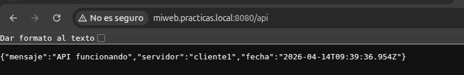

# Ejercicio 3.4 - Configurar Nginx (web estática + reverse proxy)

## Objetivo
Crear una web estática con Nginx, instalar Node.js con una API Express y configurar Nginx como reverse proxy.

## 1. Web estática

### Crear el directorio y la pagina

```bash
mkdir -p /var/www/miweb
nano /var/www/miweb/index.html
```

Contenido de index.html:

```html
<!DOCTYPE html>
<html>
<head>
    <title>Practicas Zataca</title>
    <style>
        body { font-family: Arial; max-width: 800px; margin: 50px auto; background: #f5f5f5; }
        h1 { color: #2c3e50; }
        .info { background: white; padding: 20px; border-radius: 8px; box-shadow: 0 2px 4px rgba(0,0,0,0.1); }
    </style>
</head>
<body>
    <h1>Servidor Web - Practicas FCT</h1>
    <div class="info">
        <p><strong>Alumno:</strong> Danny Ruiz Boluda</p>
        <p><strong>Empresa:</strong> Zataca Systems</p>
        <p><strong>Servidor:</strong> cliente1 (10.160.218.20)</p>
        <p><strong>Servicio:</strong> Nginx</p>
    </div>
</body>
</html>
```

### Configurar virtual host

```bash
nano /etc/nginx/sites-available/miweb
```

```nginx
server {
    listen 80;
    server_name miweb.practicas.local;
    root /var/www/miweb;
    index index.html;

    location / {
        try_files $uri $uri/ =404;
    }

    access_log /var/log/nginx/miweb-access.log;
    error_log /var/log/nginx/miweb-error.log;
}
```

Activar el site y eliminar el default:

```bash
ln -s /etc/nginx/sites-available/miweb /etc/nginx/sites-enabled/
rm /etc/nginx/sites-enabled/default
nginx -t
systemctl reload nginx
```

### Acceso desde PC local

Añadir al /etc/hosts del PC local:
```bash
echo "127.0.0.1 miweb.practicas.local" | sudo tee -a /etc/hosts
```

Acceder via tunel SSH: `http://miweb.practicas.local:8080`


## 2. API con Node.js y Express

### Instalación

```bash
apt install -y nodejs npm
mkdir -p /opt/miapi
cd /opt/miapi
npm init -y
npm install express
```

### Código de la API (/opt/miapi/server.js)

```javascript
const express = require('express');
const app = express();

app.get('/api', (req, res) => {
    res.json({
        mensaje: 'API funcionando',
        servidor: 'cliente1',
        fecha: new Date().toISOString()
    });
});

app.get('/api/info', (req, res) => {
    res.json({
        alumno: 'Danny Ruiz Boluda',
        empresa: 'Zataca Systems',
        curso: 'FCT 2026'
    });
});

app.listen(3000, () => {
    console.log('API escuchando en puerto 3000');
});
```

### Arrancar la API

```bash
node server.js &
curl http://localhost:3000/api
# {"mensaje":"API funcionando","servidor":"cliente1","fecha":"2026-04-14T09:36:30.911Z"}
```

## 3. Nginx como reverse proxy

### Configuración actualizada (/etc/nginx/sites-available/miweb)

```nginx
server {
    listen 80;
    server_name miweb.practicas.local;
    root /var/www/miweb;
    index index.html;

    location / {
        try_files $uri $uri/ =404;
    }

    location /api {
        proxy_pass http://127.0.0.1:3000;
        proxy_set_header Host $host;
        proxy_set_header X-Real-IP $remote_addr;
        proxy_set_header X-Forwarded-For $proxy_add_x_forwarded_for;
    }

    access_log /var/log/nginx/miweb-access.log;
    error_log /var/log/nginx/miweb-error.log;
}
```

### Que hace el reverse proxy
- Las peticiones a `/` sirven la web estática desde /var/www/miweb
- Las peticiones a `/api` se reenvian a Node.js en el puerto 3000
- Los headers `X-Real-IP` y `X-Forwarded-For` pasan la IP real del cliente a la API

```bash
nginx -t
systemctl reload nginx
```

### Verificación

Acceso a `http://miweb.practicas.local:8080/api` desde el navegador:



## Resultado
- Web estática servida por Nginx en miweb.practicas.local
- API Express con Node.js en puerto 3000 (endpoints /api y /api/info)
- Nginx como reverse proxy redirige /api a Node.js
- Todo accesible desde PC local via tunel SSH

!!! warning "Lo que verás en los logs"
    Un `tail -f /var/log/nginx/*-access.log` en un servidor público revela un chorro de bots escaneando rutas raras: `/wp-admin`, `/.env`, `/admin.php`... Cada uno es un intento de `hack` automatizado. Por eso se registran y se filtran con fail2ban.
