# Ejercicio 4.1 - Crear y gestionar VMs en Proxmox

## Objetivo
Crear una maquina virtual desde cero en Proxmox VE, configurarla, hacer un snapshot del estado limpio, instalar servicios y romper algo para despues restaurar el snapshot.

## Entorno
- Nodo: Practicas (10.160.218.10)
- Proxmox VE 8.4.17
- VM anidada sin VT-x/KVM disponible
- ISO disponible: debian-13.4.0-amd64-netinst.iso

## Parametros de la VM

| Campo | Valor |
|-------|-------|
| Node | Practicas |
| VM ID | 100 |
| Nombre | practica4 (hostname: `practica4`) |
| SO | Debian 13.4.0 (netinst) |
| Type | Linux 6.x - 2.6 Kernel |
| Machine | Default (i440fx) |
| BIOS | Default (SeaBIOS) |
| SCSI Controller | VirtIO SCSI single |
| Disco | 32 GiB, QEMU qcow2, IO thread |
| CPU | qemu64, 1 socket, 4 cores |
| RAM | 2048 MiB |
| Red | VirtIO, bridge vmbr0 |
| IP | 10.160.218.104 (DHCP asignado por cliente1) |

## 1. Creacion de la VM

Desde la interfaz web de Proxmox: **Datacenter -> Practicas -> Create VM**.

### 1.1 General
VM ID 100, nombre `practica4`, nodo `Practicas`.

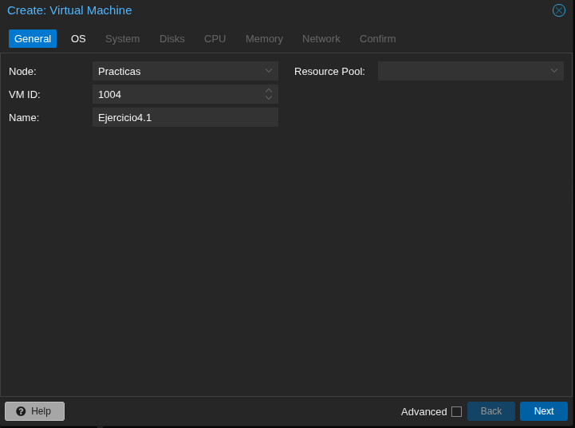

### 1.2 OS
Seleccionamos la ISO `debian-13.4.0-amd64-netinst.iso` del storage `local`. Tipo Linux, version 6.x - 2.6 Kernel.

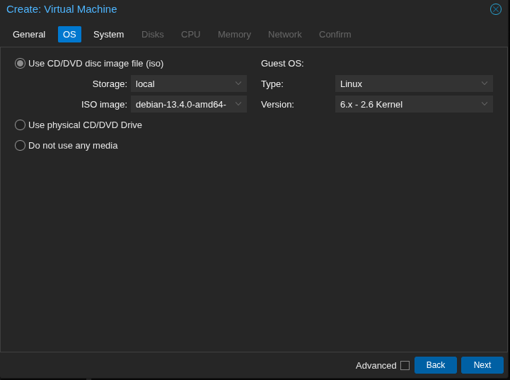

### 1.3 System
Valores por defecto: tarjeta grafica Default, Machine `i440fx`, BIOS `SeaBIOS`, **SCSI Controller `VirtIO SCSI single`**. No se activa Qemu Agent ni TPM.

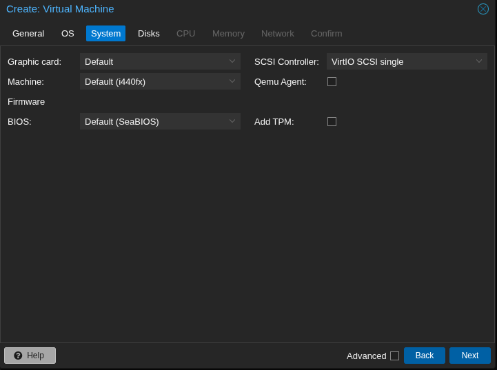

### 1.4 Disks
Un unico disco SCSI de 32 GiB en storage `local`, formato `QEMU image format` (qcow2). Activamos `IO thread` (mejor rendimiento en VirtIO SCSI single).

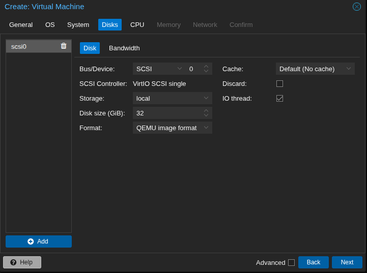

### 1.5 CPU - Ajuste necesario

Por defecto Proxmox 8 propone tipo `x86-64-v2-AES`:

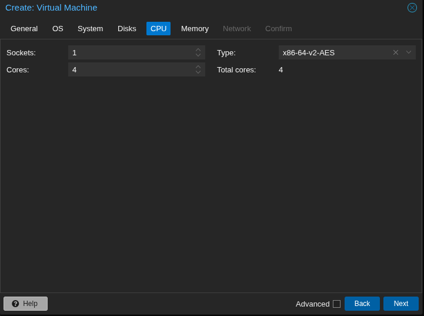

!!! warning "Problema en Proxmox anidado"
    Este Proxmox es a su vez una VM dentro de otro Proxmox (sin VT-x). Sin KVM, las VMs se ejecutan emuladas con TCG y el tipo `x86-64-v2-AES` no funciona correctamente. Hay que cambiarlo a **`qemu64`**, que es el mismo tipo que usan `cliente1` y `cliente2`.

Cambiamos `Type` a `qemu64`:

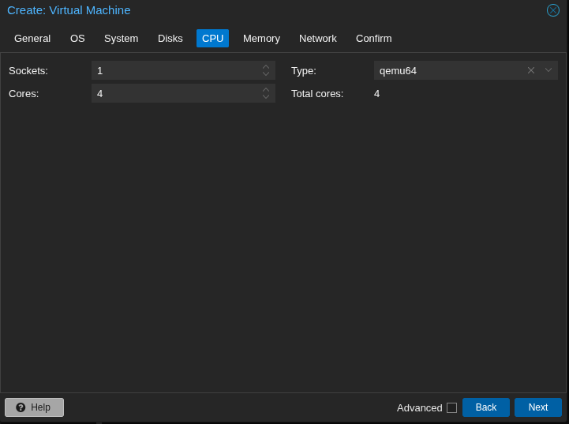

### 1.6 Memory
2048 MiB de RAM.

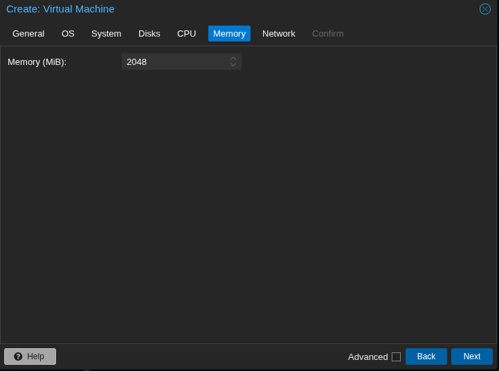

### 1.7 Network
Bridge `vmbr0`, modelo `VirtIO (paravirtualized)`, firewall activado.

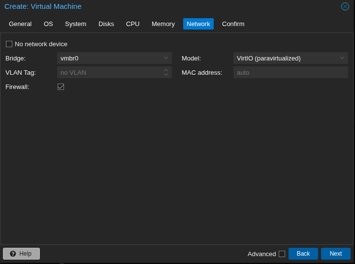

### 1.8 Confirm
Resumen de la configuracion antes de crear la VM. Desmarcamos `Start after created` para poder ajustar opciones antes de arrancar.

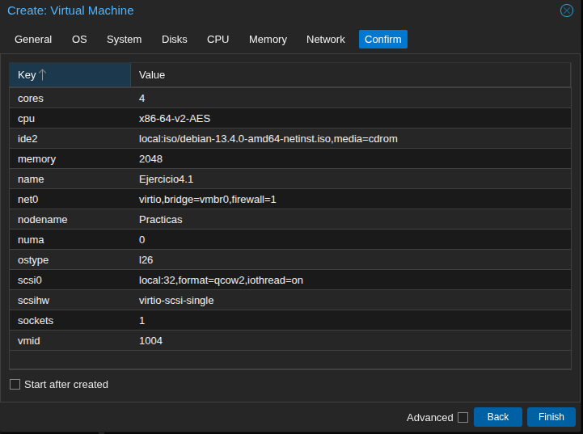

### 1.9 Ajuste previo al arranque: desactivar KVM

Por el problema de virtualizacion anidada, hay que desactivar KVM hardware virtualization antes de arrancar la VM:

1. Seleccionar la VM `100 (practica4)` en el arbol
2. Ir a **Options**
3. Doble click en **KVM hardware virtualization**
4. Desmarcar la casilla y pulsar OK

Sin este ajuste, la VM no arranca en un Proxmox anidado. Verificacion del parametro en la config:

```
# sudo qm config 100 | grep kvm
kvm: 0
```

## 2. Instalacion de Debian 13

Arrancamos la VM y accedemos a la consola noVNC. Pantallas estandar del instalador: idioma (Espanol), ubicacion (Espana), teclado (Espanol), hostname (`practica4`), dominio (vacio), usuario (`danbol`), particionado guiado (todo en una particion).

### 2.1 Configuracion del gestor de paquetes

Paso de proxy HTTP: lo dejamos en blanco (no hay proxy en el laboratorio).

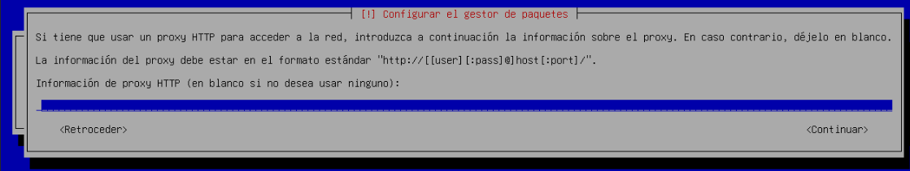

Seleccionamos replica `deb.debian.org` (CDN oficial con IPs de Fastly):

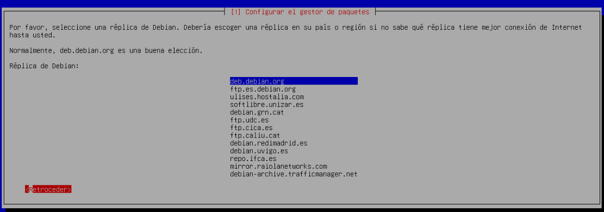

### 2.2 Problema DNS y solucion

El instalador falla al resolver `deb.debian.org`:

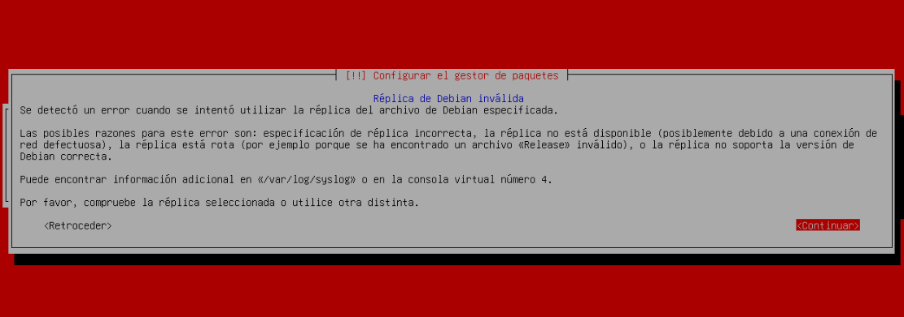

**Causa:** El laboratorio tiene DNS externo bloqueado. Aunque la VM tiene ruta a internet, no resuelve nombres.

**Solucion:** Abrir una shell en TTY2 con **Ctrl+Alt+F2** (desde el menu `Send Key` de noVNC) y anadir manualmente al fichero `/etc/hosts` del instalador la IP real de `deb.debian.org` (CDN Fastly, p.ej. `151.101.130.132`):

```bash
echo "151.101.130.132 deb.debian.org" >> /etc/hosts
```

Volver con **Ctrl+Alt+F1** y retroceder en el asistente para reintentar la seleccion del mirror.

### 2.3 Seleccion de software
En la pantalla de `tasksel` **desmarcamos el entorno de escritorio** y dejamos unicamente:

- standard system utilities

*Nota*: En esta instalacion NO se marco `SSH server` (se instalara manualmente despues). Tampoco se instalo `sudo`.

### 2.4 Arranque inicial - sources.list con solo CD

Tras el primer arranque, intentamos `apt update` y falla porque la unica fuente configurada es el CD-ROM:

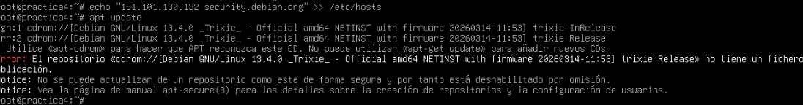

Corregimos `sources.list` con los mirrors de red. Como root:

```bash
cat > /etc/apt/sources.list << 'EOF'
deb http://deb.debian.org/debian trixie main
deb http://deb.debian.org/debian trixie-updates main
deb http://security.debian.org/debian-security trixie-security main
EOF

apt update
apt install -y sudo openssh-server
usermod -aG sudo danbol
systemctl enable --now ssh
```

(Previamente tambien anadimos al `/etc/hosts` del sistema instalado las mismas entradas de `deb.debian.org` y `security.debian.org`.)

## 3. Configuracion de acceso SSH

La VM `practica4` esta en la red interna del Proxmox (10.160.218.0/24), no accesible directamente desde el PC. Usamos **ProxyJump** a traves del nodo Proxmox `servidor`.

### 3.1 Copia de clave publica

Desde el PC local:

```bash
ssh-copy-id -o ProxyJump=servidor danbol@10.160.218.104
```

### 3.2 Alias en `~/.ssh/config`

Se anade una entrada para acceder como `ssh practica4`:

```
Host practica4
    HostName 10.160.218.104
    User danbol
    ProxyJump servidor
    IdentityFile ~/.ssh/id_ed25519
```

### 3.3 Verificacion

```
$ ssh practica4 "hostname; whoami; ip -4 a show ens18 | grep inet"
practica4
danbol
    inet 10.160.218.104/24 brd 10.160.218.255 scope global dynamic noprefixroute ens18
```

## 4. Snapshot del estado limpio

Creamos el snapshot **`limpio`** desde la web (VM 100 -> Snapshots -> Take Snapshot):

- Name: `limpio`
- Include RAM: desmarcado (snapshot rapido, VM apagada)
- Description: `Estado limpio tras instalacion Debian 13 + SSH`

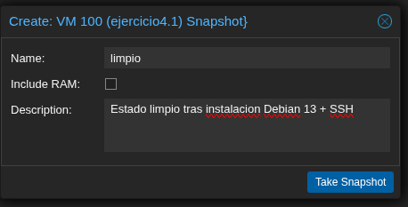

Lista de snapshots tras la creacion:

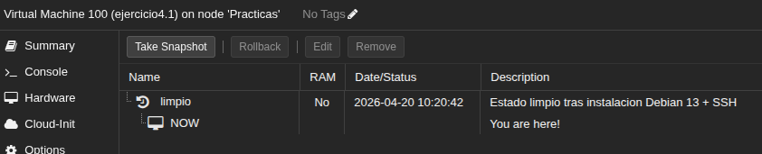

Verificacion por CLI:

```
# sudo qm listsnapshot 100
`-> limpio                2026-04-20 10:20:42    Estado limpio tras instalacion Debian 13 + SSH
 `-> current                                     You are here!
```

## 5. Instalar servicio y romper

### 5.1 Instalar Nginx

Instalamos `nginx` + `curl` y servimos una pagina personalizada:

```bash
sudo apt install -y nginx curl
echo '<h1>practica4 - Ejercicio 4.1</h1><p>Snapshot de prueba Proxmox</p>' \
  | sudo tee /var/www/html/index.html
systemctl is-active nginx     # active
curl -s http://localhost/
```

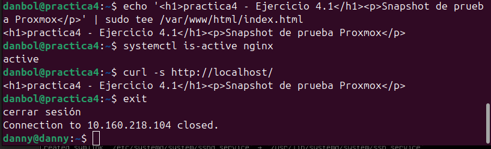

### 5.2 Romper el servicio

Purgamos nginx, borramos la config y el document root:

```bash
sudo apt purge -y nginx nginx-common nginx-core
sudo rm -rf /var/www/html /etc/nginx
which nginx || echo "NGINX DESINSTALADO"
ls /etc/nginx 2>&1
```

Resultado: `NGINX DESINSTALADO`, `/etc/nginx: No existe el fichero o el directorio`.

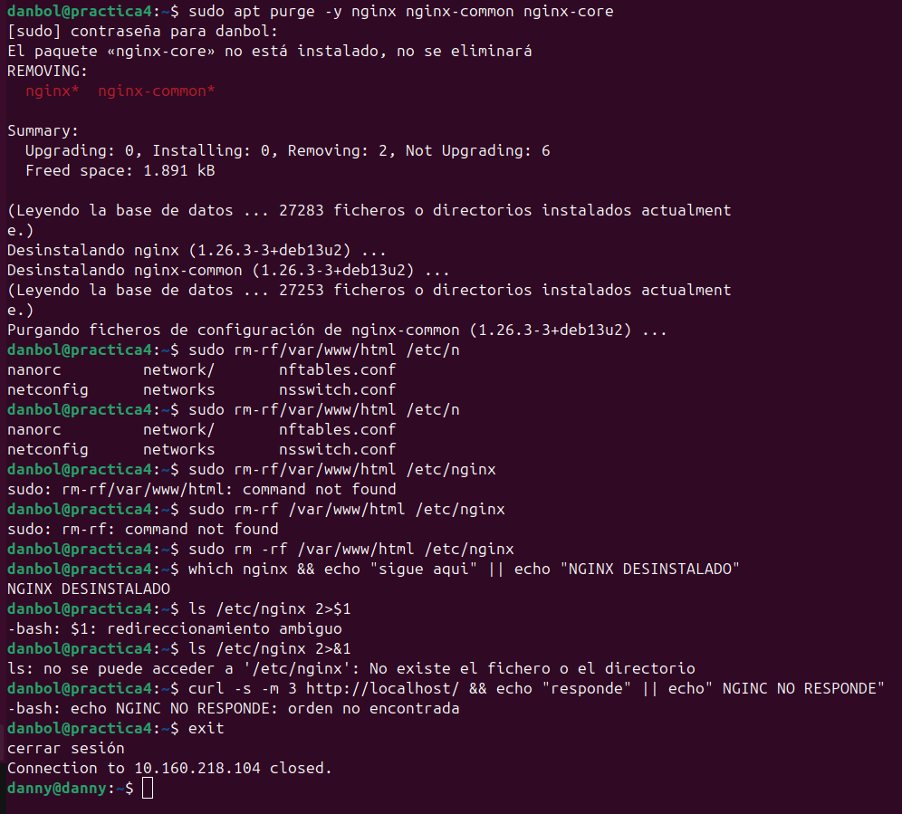

## 6. Rollback al snapshot limpio

Desde la web: **VM 100 -> Snapshots -> seleccionar `limpio` -> Rollback**.

Proxmox apaga la VM, reescribe el disco al estado del snapshot y arranca de nuevo.

### Verificacion del rollback

```
$ ssh practica4 "uptime; dpkg -l 2>/dev/null | grep -i nginx || echo 'nginx NO instalado'; grep -c 'install nginx' /var/log/dpkg.log 2>/dev/null"
 10:37:13 up 3 min,  3 users,  load average: 0,04, 0,11, 0,06
nginx NO instalado
0
```

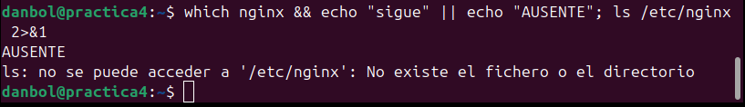

- **uptime: 3 min** -> la VM se apago y arranco de nuevo con el rollback
- **`dpkg -l | grep nginx`**: no devuelve nada -> nginx no esta instalado
- **`/var/log/dpkg.log`**: 0 lineas con `install nginx` -> no hay rastro de la instalacion previa

El sistema ha vuelto exactamente al estado del snapshot `limpio`.

## Resultado
- VM `practica4` (ID 100) creada desde cero con Debian 13.4
- Ajuste de tipo de CPU a `qemu64` y desactivacion de KVM por virtualizacion anidada
- Resuelto problema de DNS del laboratorio anadiendo `/etc/hosts` manualmente (tanto en el instalador TTY2 como en el sistema instalado)
- Acceso SSH configurado via ProxyJump desde el PC: `ssh practica4`
- Snapshot `limpio` creado antes de instalar servicios
- Probado el ciclo **instalar servicio -> romper -> rollback** con Nginx: tras el rollback la VM vuelve al estado previo (sin nginx) y no queda rastro en logs ni paquetes

## Conceptos aplicados
- **Snapshot**: captura puntual del disco + estado de la VM. Permite revertir cambios sin reinstalar.
- **Rollback**: aplicar un snapshot sobrescribiendo el estado actual (operacion destructiva del estado posterior).
- **Virtualizacion anidada**: limitaciones al ejecutar un hipervisor dentro de otro (sin VT-x anidado obliga a emular la CPU, tipo `qemu64`).
- **ProxyJump (`-J`)**: tuneliza SSH a traves de un host intermedio; util para llegar a maquinas de redes internas.

!!! note "Pausa cultural"
    Este ejercicio tiene `sudo` por todas partes. Si a media mañana te pones a probar cosas raras con sudo, no olvides el clásico `sudo make me a sandwich` — xkcd #149. La máquina no responde, pero la gente mayor de 30 sí.
