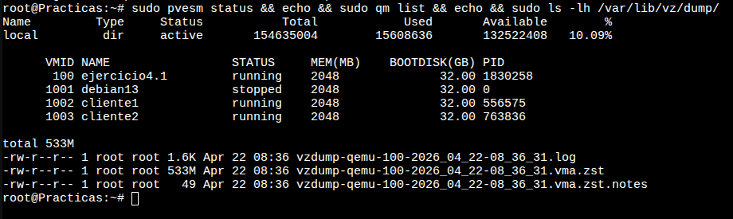
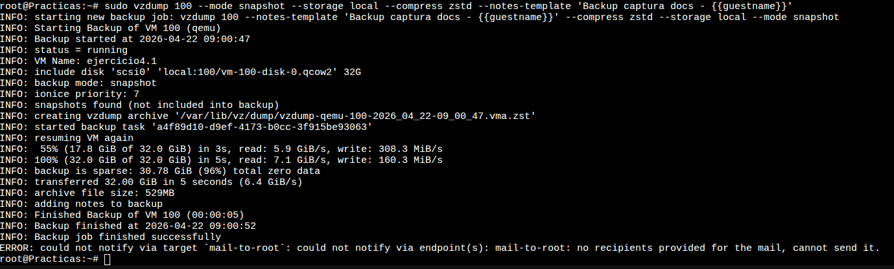
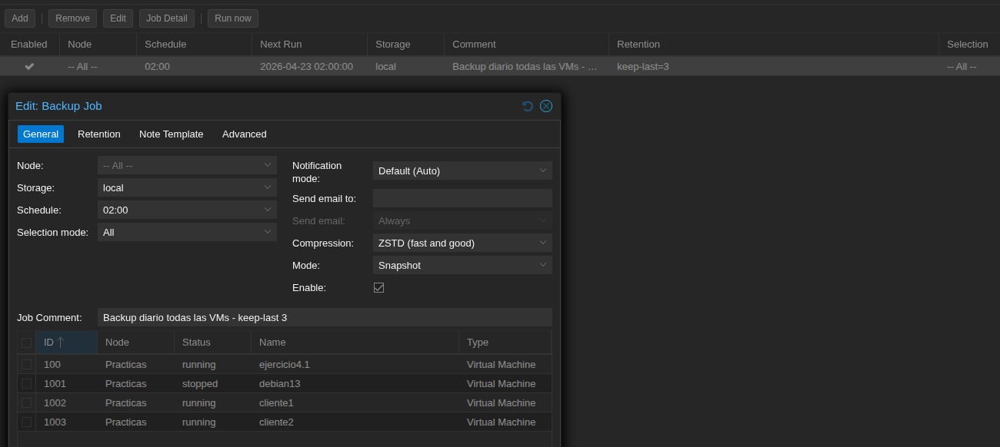
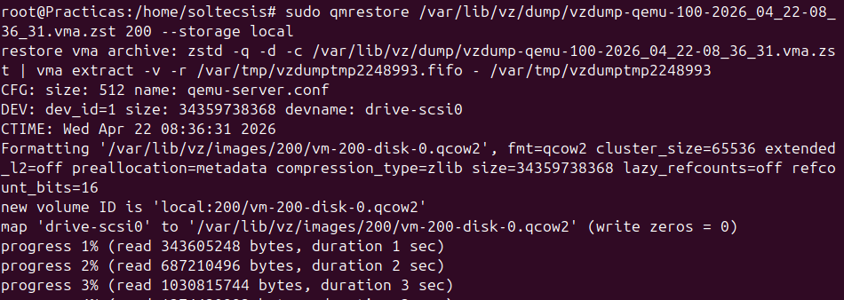
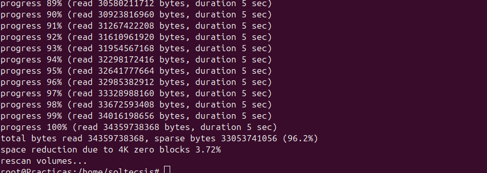
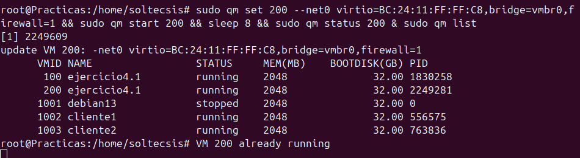
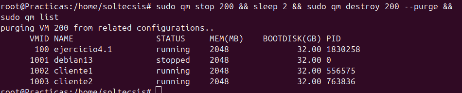

# Ejercicio 4.2 (cont.): Backups con vzdump y restauración

## Objetivo

Continuar con el Día 5 del Módulo 4: crear un backup de una VM con `vzdump`, programar un job automático con política de retención, y verificar que se puede restaurar el archivo.

## Contexto previo

En la primera parte del ejercicio 4.2 se revisaron los tipos de almacenamiento del nodo `Practicas`. En este nodo hay un único storage `local` de tipo `dir`, con ~150 GB y admite contenido de tipo `backup`, así que sirve como destino.

Estado inicial: storage, VMs del nodo y backup ya generado en `/var/lib/vz/dump/`:



```
$ sudo pvesm status
Name         Type     Status           Total            Used       Available        %
local         dir     active       154635004        15608636       132522408   10.09%

$ sudo qm list
VMID NAME                STATUS     MEM(MB)    BOOTDISK(GB)
 100 ejercicio4.1        running    2048              32.00
1001 debian13            stopped    2048              32.00
1002 cliente1            running    2048              32.00
1003 cliente2            running    2048              32.00
```

## 1. Backup manual con vzdump

`vzdump` es la herramienta de backup de Proxmox. Crea un archivo comprimido con la imagen de una VM o contenedor.

### Modos de backup

| Modo | Cómo funciona | Estado de la VM |
|------|---------------|-----------------|
| `stop` | Apaga la VM, hace la copia, la vuelve a arrancar. | Hay interrupción de servicio. |
| `suspend` | Suspende (congela) la VM mientras copia. | Poca interrupción. Solo LXC. |
| `snapshot` | Crea un snapshot temporal y copia desde él mientras la VM sigue corriendo. | **Sin interrupción.** Requiere que el almacenamiento soporte snapshots. |

Para este ejercicio se usa `snapshot`, que es el recomendado cuando se puede.

### Compresión

| Opción | Velocidad | Ratio | Notas |
|--------|-----------|-------|-------|
| `0` | Máxima | - | Sin comprimir |
| `gzip` | Lenta | Medio | Más CPU |
| `lzo` | Muy rápida | Bajo | |
| `zstd` | Rápida | Bueno | Recomendado en Proxmox 8 |

### Comando ejecutado

Se hace backup de la VM 100 (la del ejercicio 4.1):

```bash
sudo vzdump 100 \
  --mode snapshot \
  --storage local \
  --compress zstd \
  --notes-template 'Backup manual ejercicio 4.2 vzdump - {{guestname}}'
```

Salida completa de la ejecución:



Fragmento clave:

```
INFO: Starting Backup of VM 100 (qemu)
INFO: VM Name: ejercicio4.1
INFO: include disk 'scsi0' 'local:100/vm-100-disk-0.qcow2' 32G
INFO: backup mode: snapshot
INFO: creating vzdump archive '/var/lib/vz/dump/vzdump-qemu-100-*.vma.zst'
INFO:  55% (17.8 GiB of 32.0 GiB) in 3s, read: 5.9 GiB/s
INFO: 100% (32.0 GiB of 32.0 GiB) in 5s, read: 7.1 GiB/s
INFO: backup is sparse: 30.78 GiB (96%) total zero data
INFO: transferred 32.00 GiB in 5 seconds (6.4 GiB/s)
INFO: archive file size: 529MB
INFO: Finished Backup of VM 100 (00:00:05)
INFO: Backup job finished successfully
```

> El mensaje final `ERROR: could not notify via target mail-to-root` es solo un aviso: Proxmox intenta enviar un correo de resumen y el destinatario por defecto (`root@`) no tiene dirección configurada. No afecta al backup, que ya terminó con éxito justo arriba.

Resultado:

- Disco virtual: **32 GiB**
- Archivo comprimido: **532 MB** (el 96% del disco eran ceros → sparse muy eficiente)
- Tiempo total: **19 s**

Ficheros generados en `/var/lib/vz/dump/`:

```
-rw-r--r-- 1 root root 1.6K  vzdump-qemu-100-2026_04_22-08_36_31.log
-rw-r--r-- 1 root root 533M  vzdump-qemu-100-2026_04_22-08_36_31.vma.zst
-rw-r--r-- 1 root root   49  vzdump-qemu-100-2026_04_22-08_36_31.vma.zst.notes
```

Tres ficheros por backup: el `.vma.zst` con la imagen comprimida, un `.log` con la traza, y un `.notes` con el texto de la plantilla.

El archivo también aparece listado en el contenido del storage:

```bash
$ sudo pvesm list local --vmid 100
Volid                                                    Format  Type             Size
local:100/vm-100-disk-0.qcow2                            qcow2   images    34359738368
local:backup/vzdump-qemu-100-2026_04_22-08_36_31.vma.zst vma.zst backup      558308923
```

## 2. Programación automática con retención

El objetivo ahora es que los backups se creen solos cada noche y que solo se conserve un número limitado (retención), para no llenar el disco.

### Crear el backup job

```bash
sudo pvesh create /cluster/backup \
  --schedule '02:00' \
  --storage local \
  --all 1 \
  --mode snapshot \
  --compress zstd \
  --prune-backups 'keep-last=3' \
  --enabled 1 \
  --comment 'Backup diario todas las VMs - keep-last 3'
```

Opciones usadas:

| Opción | Valor | Efecto |
|--------|-------|--------|
| `--schedule` | `02:00` | Cada día a las 02:00. Formato calendar de systemd. |
| `--storage` | `local` | Dónde se guardan los dumps. |
| `--all` | `1` | Incluye todas las VMs y contenedores del nodo. |
| `--mode` | `snapshot` | Sin parar las VMs. |
| `--compress` | `zstd` | Compresión recomendada. |
| `--prune-backups` | `keep-last=3` | **Retención:** mantener solo los 3 backups más recientes por VM. Los más antiguos se borran automáticamente. |
| `--enabled` | `1` | Job activo. |

### Verificación en la GUI

En **Datacenter → Backup** aparece el job creado. La columna *Next Run* muestra la próxima ejecución programada:



En la parte inferior, el cuadro *Edit: Backup Job* permite revisar y modificar cada opción. La pestaña **General** reúne schedule, storage, compresión, modo y selección de VMs; la pestaña **Retention** expone las claves de retención (`keep-last`, `keep-daily`, etc.); y la pestaña **Note Template** muestra la plantilla de notas asociada a cada backup.

El listado de VMs del job (100, 1001, 1002, 1003) aparece abajo porque está seleccionado modo `All`: incluye todas las VMs del nodo.

### Verificación por CLI

Proxmox guarda la config en `/etc/pve/jobs.cfg`:

```
vzdump: 896d917f-0bb5-487d-b201-623930dabba9
    comment Backup diario todas las VMs - keep-last 3
    schedule 02:00
    all 1
    compress zstd
    enabled 1
    mode snapshot
    prune-backups keep-last=3
    storage local
```

Cada job tiene un UUID propio. Para listar los jobs existentes:

```bash
sudo pvesh get /cluster/backup
```

### Otras políticas de retención posibles

`prune-backups` admite varias claves combinables:

| Clave | Qué mantiene |
|-------|--------------|
| `keep-last=N` | Los N backups más recientes (sin importar la fecha). |
| `keep-hourly=N` | El más reciente de cada una de las últimas N horas. |
| `keep-daily=N` | El más reciente de cada uno de los últimos N días. |
| `keep-weekly=N` | El más reciente de cada una de las últimas N semanas. |
| `keep-monthly=N` | El más reciente de cada uno de los últimos N meses. |
| `keep-yearly=N` | El más reciente de cada uno de los últimos N años. |

Un ejemplo más completo (estilo abuelo-padre-hijo):

```
--prune-backups 'keep-last=3,keep-daily=7,keep-weekly=4,keep-monthly=6'
```

## 3. Restauración de backups

Para demostrar que el backup es válido se restaura el `.vma.zst` como una **VM nueva con ID 200**, sin tocar la VM 100 original.

### Comando

```bash
sudo qmrestore /var/lib/vz/dump/vzdump-qemu-100-2026_04_22-08_36_31.vma.zst 200 \
  --storage local
```

Inicio del proceso: `qmrestore` desempaqueta el `.vma.zst`, formatea un `qcow2` nuevo para la VM 200 y empieza a escribir los bloques.



Final del proceso:



```
progress 100% (read 34359738368 bytes, duration 5 sec)
total bytes read 34359738368, sparse bytes 33053741056 (96.2%)
space reduction due to 4K zero blocks 3.72%
rescan volumes...
```

Restauración completa en **5 segundos** gracias a que el 96% son bloques vacíos. El `rescan volumes...` del final hace que Proxmox reconozca el nuevo disco y lo asocie a la VM 200.

### Verificación de la config restaurada

```
$ sudo qm list
VMID NAME                STATUS     MEM(MB)    BOOTDISK(GB)
 100 ejercicio4.1        running    2048              32.00
 200 ejercicio4.1        stopped    2048              32.00   <-- restaurada
1002 cliente1            running    2048              32.00
1003 cliente2            running    2048              32.00

$ sudo qm config 200
boot: order=scsi0;ide2;net0
cores: 4
cpu: qemu64
memory: 2048
name: ejercicio4.1
net0: virtio=BC:24:11:41:B2:37,bridge=vmbr0,firewall=1
scsi0: local:200/vm-200-disk-0.qcow2,iothread=1,size=32G
scsihw: virtio-scsi-single
```

La 200 es una copia exacta de la 100, **incluyendo la dirección MAC**.

### Cuidado con la MAC duplicada

Si se arranca la 200 tal cual mientras la 100 está corriendo en el mismo bridge, hay **conflicto de MAC en la red** — las dos VMs competirían por la misma dirección y el switch virtual se vuelve loco.

Solución: antes de arrancar la copia, cambiar su MAC:

```bash
sudo qm set 200 --net0 virtio=BC:24:11:FF:FF:C8,bridge=vmbr0,firewall=1
```

### Arranque de prueba

Con MAC ya cambiada:

```bash
sudo qm start 200
sudo qm status 200
# status: running
```



En el `qm list` aparecen **las dos VMs corriendo a la vez** (100 y 200), cada una con su propio PID (`1830258` y `2249281`). La restaurada es funcional y arranca sin tocar a la original → el backup es válido.

### Limpieza

Como era solo para verificar, se apaga y se destruye la copia:

```bash
sudo qm stop 200
sudo qm destroy 200 --purge
```

La flag `--purge` elimina también las referencias de la VM en replicación, firewall y otros módulos.

Estado final tras la limpieza:



La VM original (100) nunca se ha detenido durante todo el ejercicio. La copia temporal 200 ha desaparecido del listado tras el `destroy --purge`.

## Resumen

| Punto | Herramienta | Resultado |
|-------|-------------|-----------|
| Backup manual | `vzdump 100 --mode snapshot --compress zstd` | 32 GiB → 532 MB en 19 s |
| Programación | `pvesh create /cluster/backup --schedule 02:00 ...` | Job diario a las 02:00 |
| Retención | `--prune-backups keep-last=3` | Solo los 3 backups más recientes |
| Restauración | `qmrestore archivo.vma.zst 200` | VM 200 creada y arrancada en 5 s |
| Conflicto MAC | `qm set 200 --net0 virtio=<nueva-MAC>,...` | Necesario antes de arrancar copia |
| Limpieza | `qm destroy 200 --purge` | Copia de prueba eliminada |

Con esto queda cubierto el Día 5 del Módulo 4:

- [x] Tipos de almacenamiento (parte 1)
- [x] Backups: vzdump, programación, retención
- [x] Restauración de backups

!!! quote "Dadjoke de cierre"
    *"Los backups son una religión. Los restores son el milagro."*  
    Hoy hemos tenido ambos.
