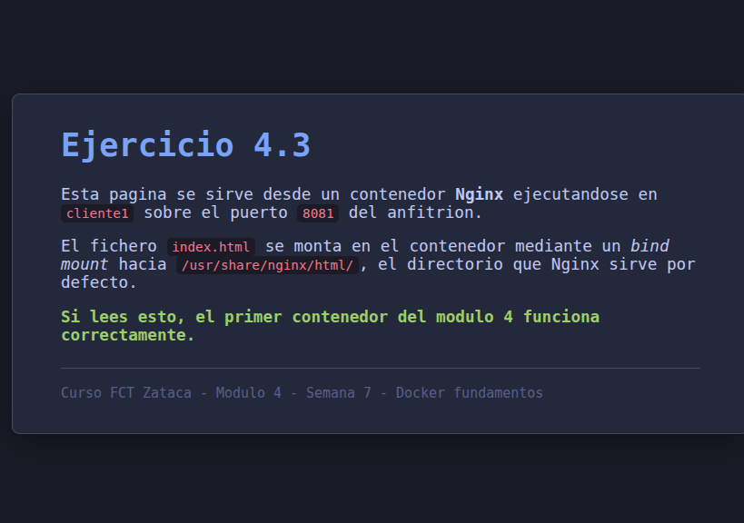
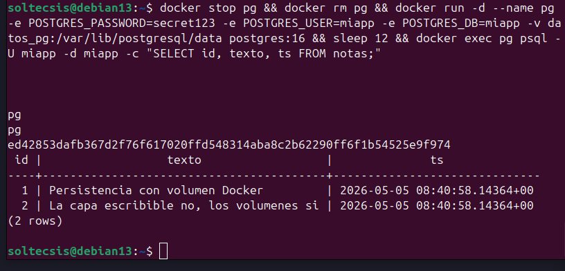

# Ejercicio 4.3 - Primeros contenedores Docker

## Objetivo
Desplegar un contenedor Nginx que sirve una pagina HTML personalizada y un contenedor PostgreSQL con un volumen persistente, y verificar que los datos sobreviven a un `docker rm` + `docker run`.

## Entorno
- Host: `cliente1` (VM 1002, 10.160.218.20, Debian 13 Trixie)
- Docker 26.1.5 (paquete `docker.io` de Trixie)
- Las imagenes base se cargaron previamente con `docker load` (DNS publico bloqueado en la red, ver [teoria-docker.md](teoria-docker.md))

## Parte 1 - Nginx con HTML personalizada

### 1.1 Preparar el contenido a servir
En `cliente1`, crear un directorio para el sitio y un `index.html`:

```bash
mkdir -p ~/docker-fct/ejercicio-4.3/html
cat > ~/docker-fct/ejercicio-4.3/html/index.html <<'HTML'
<!DOCTYPE html>
<html><head><meta charset="UTF-8"><title>Mi primer contenedor</title></head>
<body><h1>Hola desde Nginx en Docker</h1>
<p>Servida por cliente1 desde un contenedor.</p>
</body></html>
HTML
```

(En este lab el `index.html` real esta en el repo: `configs/docker/ejercicio-4.3/html/index.html`.)

### 1.2 Lanzar el contenedor Nginx con bind mount
```bash
docker run -d \
  --name web \
  -p 8081:80 \
  -v ~/docker-fct/ejercicio-4.3/html:/usr/share/nginx/html:ro \
  nginx:alpine
```

Banderas:

- `-d`: en segundo plano
- `--name web`: nombre legible
- `-p 8081:80`: publica el puerto 80 del contenedor en el 8081 del host (no chocamos con el Nginx ya instalado en cliente1 que ocupa el 80)
- `-v ...:ro`: bind mount de solo lectura del directorio con el `index.html`

### 1.3 Verificacion
```bash
docker ps                        # ver el contenedor "web" en estado Up
docker logs web                  # ver el arranque de Nginx
curl -s http://localhost:8081/   # debe devolver el HTML personalizado
```

Tambien se puede abrir desde el PC anfitrion: el tunel `ssh wiki` ya hace LocalForward del 8080, pero como aqui usamos 8081 hay que abrir un tunel adicional con `ssh -L 8081:localhost:8081 wiki` o adaptar `~/.ssh/config`.



### 1.4 Operaciones tipicas sobre el contenedor
```bash
docker exec -it web sh           # entrar al contenedor (shell de Alpine)
ls /usr/share/nginx/html         # ver el bind mount montado
exit
docker stop web                  # parar
docker start web                 # rearrancar (mantiene config y volumenes)
docker restart web               # equivalente a stop + start
docker rm -f web                 # eliminar (forzar para que pare antes)
```

## Parte 2 - PostgreSQL con volumen persistente

### 2.1 Crear un volumen named gestionado por Docker
```bash
docker volume create datos_pg
docker volume ls
docker volume inspect datos_pg
```

`docker volume inspect` muestra el `Mountpoint`, una ruta dentro de `/var/lib/docker/volumes/datos_pg/_data` gestionada por el daemon. No tocar manualmente esa ruta: se usa via la bandera `-v`.

### 2.2 Lanzar el contenedor PostgreSQL
```bash
docker run -d \
  --name pg \
  -e POSTGRES_PASSWORD=secret123 \
  -e POSTGRES_USER=miapp \
  -e POSTGRES_DB=miapp \
  -v datos_pg:/var/lib/postgresql/data \
  postgres:16
```

Variables de entorno tipicas de la imagen oficial `postgres`:

- `POSTGRES_PASSWORD`: obligatoria
- `POSTGRES_USER` / `POSTGRES_DB`: opcionales (por defecto `postgres`/`postgres`)

Verificar que ha arrancado:
```bash
docker ps
docker logs pg | tail -20        # debe terminar con "database system is ready to accept connections"
```

### 2.3 Insertar datos de prueba
```bash
docker exec -it pg psql -U miapp -d miapp
```

Dentro de `psql`:
```sql
CREATE TABLE notas (id SERIAL PRIMARY KEY, texto TEXT, ts TIMESTAMPTZ DEFAULT NOW());
INSERT INTO notas (texto) VALUES ('Persistencia con volumen Docker');
INSERT INTO notas (texto) VALUES ('La capa escribible no, los volumenes si');
SELECT * FROM notas;
\q
```

## Parte 3 - Verificar la persistencia

### 3.1 Eliminar el contenedor (no el volumen)
```bash
docker stop pg
docker rm pg
docker ps -a       # confirmar que pg ha desaparecido
docker volume ls   # datos_pg sigue ahi
```

La capa escribible del contenedor desaparece, pero los datos viven en el volumen `datos_pg`.

### 3.2 Crear un contenedor nuevo con el mismo volumen
```bash
docker run -d \
  --name pg \
  -e POSTGRES_PASSWORD=secret123 \
  -e POSTGRES_USER=miapp \
  -e POSTGRES_DB=miapp \
  -v datos_pg:/var/lib/postgresql/data \
  postgres:16
```

Las variables de entorno **solo se aplican si la base de datos no existe**. Como el directorio del volumen ya tiene un cluster PostgreSQL inicializado, `postgres:16` lo detecta y arranca contra el existente sin reinicializar.

### 3.3 Comprobar que los datos siguen ahi
```bash
docker exec -it pg psql -U miapp -d miapp -c "SELECT * FROM notas;"
```

Resultado esperado: las dos filas insertadas en el paso 2.3.



## Comprobacion final

| Verificacion | Resultado |
|---|---|
| `curl http://localhost:8081/` | HTML personalizado |
| `docker ps` muestra `web` y `pg` Up | OK |
| Datos `notas` sobreviven a `rm`+`run` | OK |
| `docker volume ls` lista `datos_pg` | OK |

## Limpieza (opcional, al terminar)

```bash
docker rm -f web pg              # parar y borrar contenedores
docker volume rm datos_pg        # borrar el volumen (¡borra los datos!)
docker rmi nginx:alpine postgres:16  # borrar imagenes
```

En este lab **no** se ejecuta la limpieza al terminar el ejercicio: las mismas imagenes se usan en el ejercicio 4.4.

## Conclusiones
- Un contenedor sin volumen pierde sus datos al ser eliminado.
- Un volumen named se gestiona desde Docker (`docker volume`) y sobrevive al ciclo de vida de los contenedores.
- El bind mount es util para servir contenido estatico desde el host (como el `index.html` de Nginx).
- Las variables de entorno de la imagen oficial de Postgres solo inicializan el cluster la primera vez; reusar el volumen no las reaplica.
