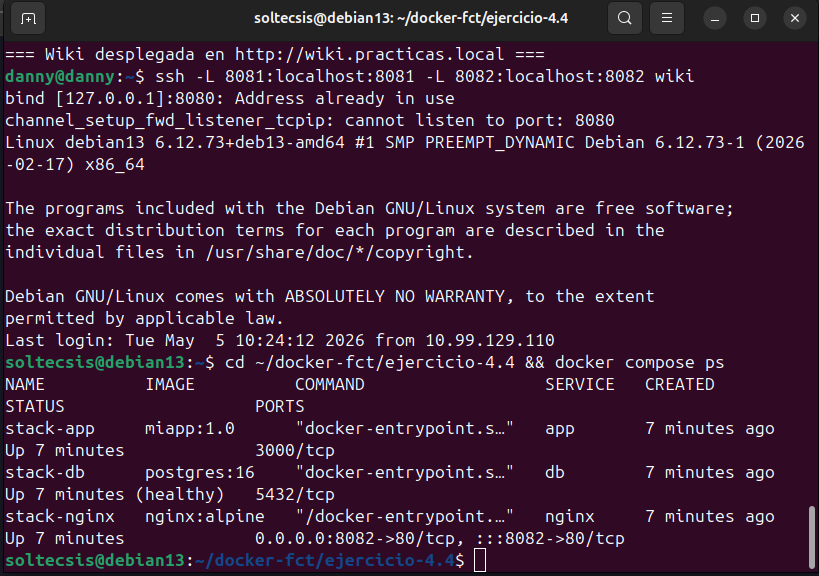
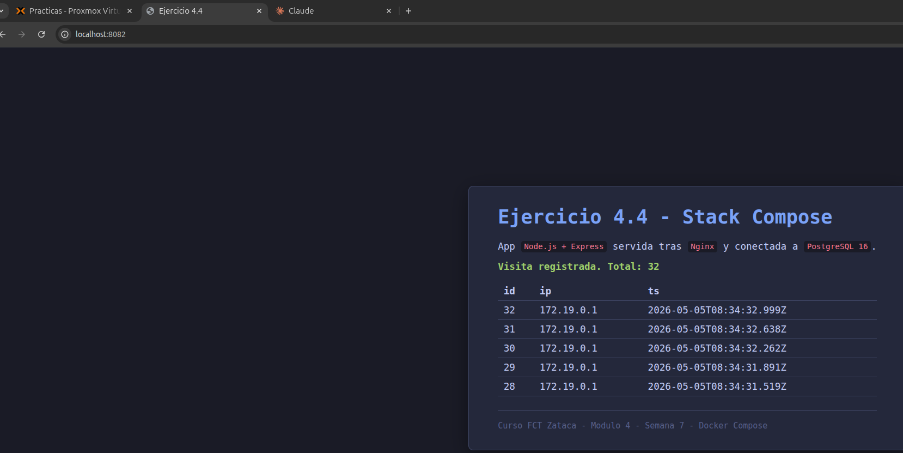

# Ejercicio 4.4 - Stack completo con Docker Compose

## Objetivo
Orquestar tres servicios con un unico fichero `docker-compose.yml`:

- **PostgreSQL 16** con volumen persistente.
- **App Node.js + Express** que conecta a la base de datos y devuelve datos.
- **Nginx** como **reverse proxy** delante de la app.

Todo el stack se levanta con un solo comando, los servicios se descubren por DNS interno de Docker, y solo el reverse proxy publica un puerto al host.

## Entorno
- Host: `cliente1`
- Docker Compose v2.26.1 (`docker compose ...` o `docker-compose ...`)
- Puerto publicado al host: **8082** (Nginx). El `8080` ya esta usado por el panel Proxmox via tunel y el `80`/`8081` por otros servicios o el ejercicio 4.3.

## Estructura del proyecto

```
docker-fct/ejercicio-4.4/
├── docker-compose.yml
├── app/
│   ├── Dockerfile          # multi-stage, usuario no-root
│   ├── .dockerignore
│   ├── package.json
│   └── server.js           # Express + pg
└── nginx/
    └── nginx.conf          # reverse proxy a app:3000
```

Todos los ficheros estan en el repo bajo `configs/docker/ejercicio-4.4/` y se transfieren a `cliente1` con `scp -r`:

```bash
scp -r configs/docker/ejercicio-4.4 wiki:~/docker-fct/
```

## Dia 3 - Dockerfile de la app Node.js

Antes del Compose, se construye una imagen propia para la app Node con buenas practicas:

```dockerfile
# Stage 1 (builder): instala dependencias de produccion
FROM node:20-slim AS builder
WORKDIR /app
COPY package*.json ./
RUN npm install --omit=dev --no-audit --no-fund

# Stage 2 (runtime): copia solo lo imprescindible y ejecuta como no-root
FROM node:20-slim AS runtime
ENV NODE_ENV=production
WORKDIR /app
RUN groupadd --system --gid 1001 miapp \
 && useradd --system --uid 1001 --gid miapp miapp
COPY --from=builder --chown=miapp:miapp /app/node_modules ./node_modules
COPY --chown=miapp:miapp server.js ./
USER miapp
EXPOSE 3000
CMD ["node", "server.js"]
```

Buenas practicas aplicadas:

- **Multi-stage build**: el `builder` se descarta tras construir, el runtime no lleva npm cache.
- **`.dockerignore`**: excluye `node_modules`, `.git`, etc. para que el contexto de build sea pequeño.
- **Capas pequeñas**: una sola `RUN` para crear el usuario.
- **Usuario no-root**: el contenedor corre como UID 1001, no como root.
- **`ENV NODE_ENV=production`**: Express activa optimizaciones.
- **`EXPOSE 3000`**: documenta el puerto (no publica nada por si solo).

### Build (en este lab, en el PC anfitrion)
```bash
docker build -t miapp:1.0 ./app
docker images miapp           # ver tamaño final (~300 MB con node:20-slim)
```

Como `cliente1` no tiene DNS publico para `registry.npmjs.org`, el `npm install` se hace en el PC anfitrion donde si hay DNS. La imagen resultante se transfiere a `cliente1` con:
```bash
docker save miapp:1.0 | gzip | ssh wiki 'gunzip | docker load'
```

En un entorno con internet, `docker compose up --build` hace lo mismo en sitio.

## docker-compose.yml comentado

```yaml
services:

  db:
    image: postgres:16
    container_name: stack-db
    restart: unless-stopped
    environment:
      POSTGRES_DB: miapp
      POSTGRES_USER: miapp
      POSTGRES_PASSWORD: secret123
    volumes:
      - db_data:/var/lib/postgresql/data
    networks:
      - backend
    healthcheck:
      test: ["CMD-SHELL", "pg_isready -U miapp -d miapp"]
      interval: 5s
      timeout: 3s
      retries: 5

  app:
    build:
      context: ./app
    image: miapp:1.0
    container_name: stack-app
    restart: unless-stopped
    environment:
      DATABASE_URL: postgresql://miapp:secret123@db:5432/miapp
      PORT: "3000"
    depends_on:
      db:
        condition: service_healthy
    networks:
      - backend

  nginx:
    image: nginx:alpine
    container_name: stack-nginx
    restart: unless-stopped
    ports:
      - "8082:80"
    volumes:
      - ./nginx/nginx.conf:/etc/nginx/conf.d/default.conf:ro
    depends_on:
      - app
    networks:
      - backend

volumes:
  db_data:

networks:
  backend:
```

Detalles:

- **`depends_on` con `condition: service_healthy`**: Compose espera a que el `healthcheck` de Postgres pase antes de arrancar la app. Sin esto, la app puede intentar conectar antes de que Postgres este listo.
- **`networks: backend`**: red bridge personalizada. Los servicios se resuelven por nombre (`db`, `app`, `nginx`).
- **Volumen `db_data`**: igual que en el ejercicio 4.3, persiste los datos de Postgres.
- **Solo `nginx` publica puerto** (`8082:80`): la app y la base de datos no son accesibles desde fuera del stack.
- **`image: miapp:1.0`** junto a `build:`: si la imagen ya existe localmente (cargada con `docker load`), Compose la usa sin reconstruir.

## nginx.conf como reverse proxy

```nginx
upstream miapp {
    server app:3000;
}

server {
    listen 80;
    server_name _;

    proxy_set_header Host              $host;
    proxy_set_header X-Real-IP         $remote_addr;
    proxy_set_header X-Forwarded-For   $proxy_add_x_forwarded_for;
    proxy_set_header X-Forwarded-Proto $scheme;

    location / {
        proxy_pass http://miapp;
    }

    location = /health {
        proxy_pass http://miapp/health;
        access_log off;
    }
}
```

`server app:3000` funciona porque Compose registra cada servicio en el DNS interno con su nombre. Nginx no necesita IPs.

## Despliegue y verificacion

### Levantar el stack
```bash
cd ~/docker-fct/ejercicio-4.4
docker compose up -d
docker compose ps
```

`docker compose ps` debe mostrar `stack-db (healthy)`, `stack-app (Up)` y `stack-nginx (Up)`.



### Probar la aplicacion

```bash
curl -s http://localhost:8082/health         # → {"status":"ok","db":true}
curl -s http://localhost:8082/ | head -30    # → HTML con el contador de visitas
```

Cada llamada a `/` inserta una fila en la tabla `visitas` y devuelve el total.



### Inspeccionar el flujo de la peticion

```bash
docker compose logs -f nginx     # peticiones entrantes al reverse proxy
docker compose logs -f app       # consultas a la base de datos
docker exec -it stack-db psql -U miapp -d miapp -c "SELECT COUNT(*) FROM visitas;"
```

### Persistencia del volumen
```bash
docker compose down              # para todos los servicios, mantiene volumenes
docker volume ls                 # ejercicio44_db_data sigue ahi
docker compose up -d             # rearrancar
curl -s http://localhost:8082/health  # vuelve a estar healthy
docker exec -it stack-db psql -U miapp -d miapp -c "SELECT COUNT(*) FROM visitas;"  # datos siguen
```

`docker compose down -v` borraria tambien los volumenes (¡cuidado!).

## Comandos esenciales de Compose

```bash
docker compose up -d                  # crear y arrancar todo en background
docker compose up -d --build          # forzar rebuild de imagenes con build:
docker compose ps                     # estado de los servicios
docker compose logs -f [servicio]     # logs (combinados o de uno solo)
docker compose exec app sh            # entrar al contenedor "app"
docker compose restart nginx          # reiniciar un servicio
docker compose stop                   # parar todo (sin eliminar)
docker compose down                   # parar y eliminar contenedores y red
docker compose down -v                # tambien elimina volumenes (datos!)
docker compose config                 # validar y mostrar el yml resuelto
```

## Conclusiones
- Un solo `docker-compose.yml` describe la pila completa: imagenes, redes, volumenes, dependencias y healthchecks.
- El DNS interno de Compose hace que los servicios se referencien por nombre, sin gestionar IPs.
- Solo se publica al host lo necesario (Nginx en este caso). La app y la base de datos quedan aisladas.
- `depends_on` con `condition: service_healthy` evita el clasico "la app arranca antes que la base de datos".
- `docker compose down` mantiene los volumenes nombrados, asi los datos sobreviven.
