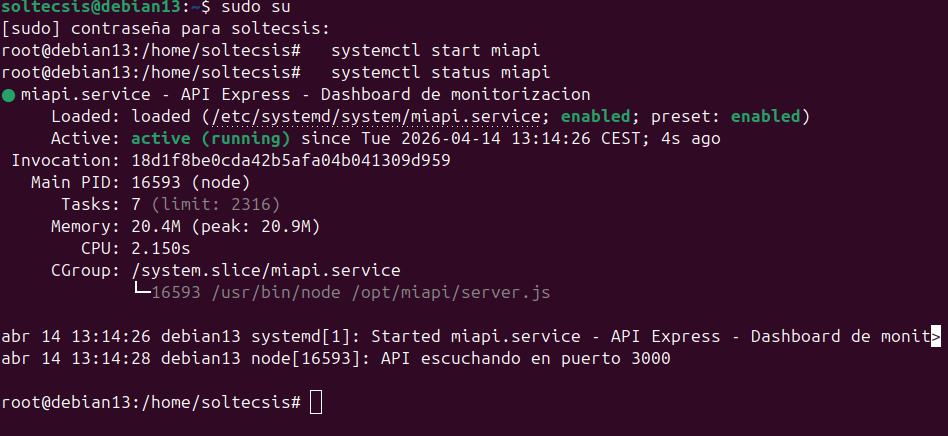
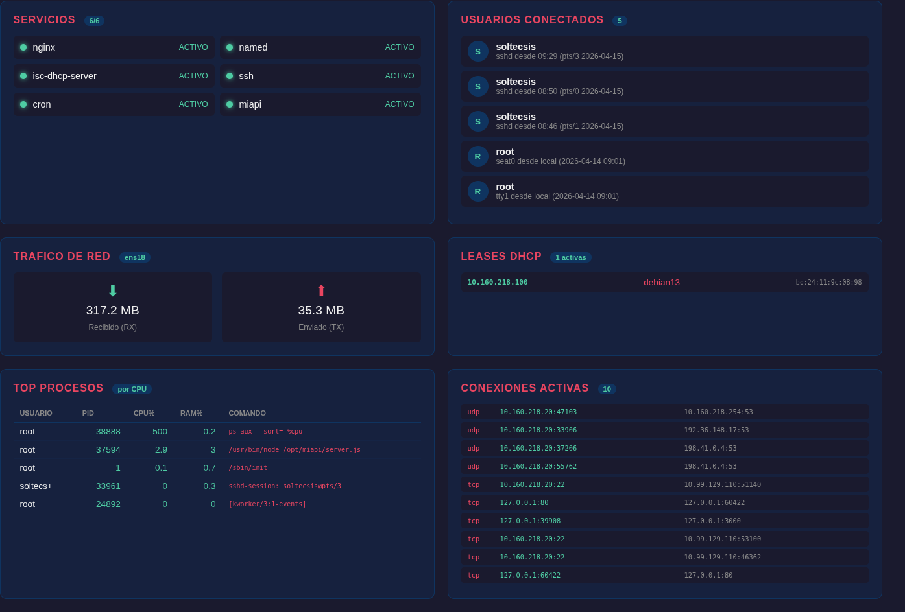
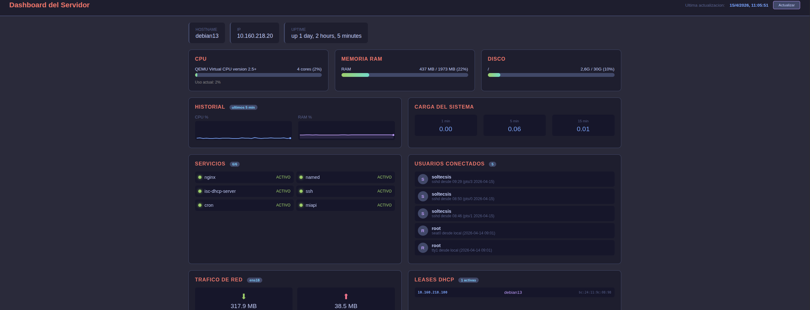
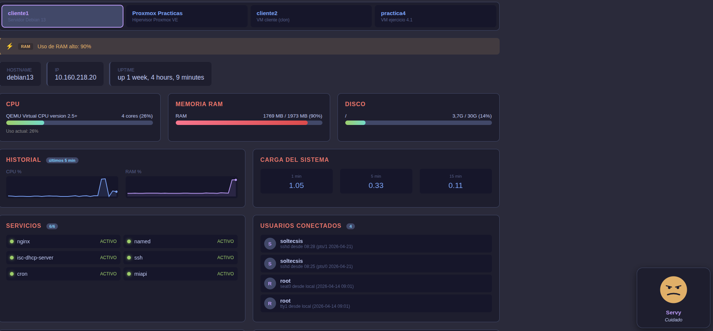
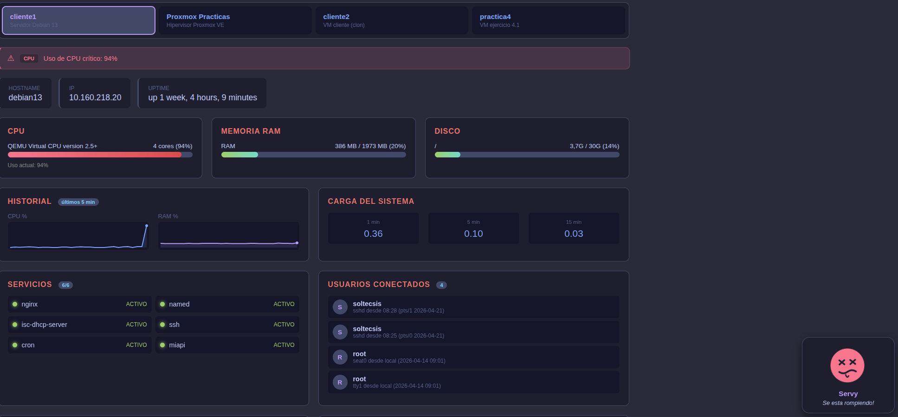
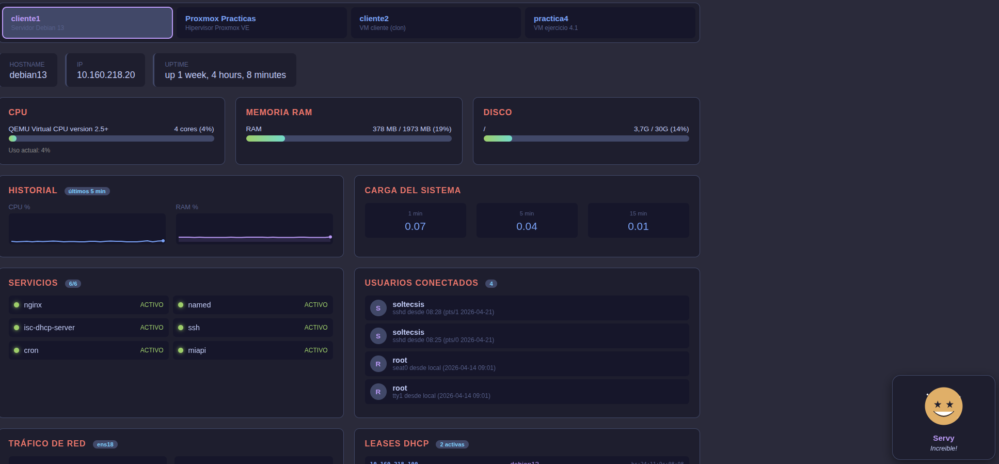

# Extra: Dashboard de monitorización

## Objetivo
Panel web en tiempo real que muestra el estado del servidor: disco, RAM, carga y servicios.

## Arquitectura

```
Navegador --> Nginx (reverse proxy) --> API Express (puerto 3000) --> datos del sistema
         <-- HTML/CSS/JS estático  <--
```

- **Frontend:** HTML + CSS + JavaScript vanilla (sin frameworks)
- **Backend:** Node.js con Express, ejecuta comandos del sistema
- **Proxy:** Nginx sirve el HTML y redirige /api a Express

## API REST (/opt/miapi/server.js)

### Endpoints

| Endpoint | Respuesta |
|----------|-----------|
| GET /api | Estado básico de la API |
| GET /api/sistema | Datos completos del servidor |

### Datos que devuelve /api/sistema

| Sección | Datos | Fuente |
|---------|-------|--------|
| CPU | Uso %, cores, modelo | `top -bn1`, `nproc`, `/proc/cpuinfo` |
| Memoria | Uso %, total, usada | `free -m` |
| Disco | Uso %, total, usado | `df /` |
| Carga | 1, 5 y 15 minutos | `/proc/loadavg` |
| Servicios | Estado de 6 servicios | `systemctl is-active` |
| Top procesos | 5 procesos con mas CPU | `ps aux --sort=-%cpu` |
| Usuarios | Sesiones SSH activas | `who` |
| Tráfico de red | Bytes RX/TX en ens18 | `/sys/class/net/ens18/statistics/` |
| Leases DHCP | IPs asignadas activas | `/var/lib/dhcp/dhcpd.leases` |
| Conexiónes | Conexiónes TCP/UDP activas | `ss -tun state established` |
| Historial | Últimos 30 valores CPU/RAM | Almacenado en memoria del servidor |

## Frontend (index.html)

### Secciónes del panel

| Sección | Descripción |
|---------|-------------|
| Info bar | Hostname, IP y uptime del servidor |
| CPU / RAM / Disco | Barras de progreso con colores (verde < 60%, amarillo < 80%, rojo >= 80%) |
| Historial | Gráficas sparkline con los últimos 5 minutos de CPU y RAM |
| Carga del sistema | Valores de carga a 1, 5 y 15 minutos |
| Servicios | 6 servicios monitorizados (nginx, named, isc-dhcp-server, ssh, cron, miapi) |
| Usuarios conectados | Sesiones SSH activas con nombre, terminal y origen |
| Tráfico de red | Bytes recibidos (RX) y enviados (TX) en ens18 |
| Leases DHCP | IPs asignadas con hostname y MAC (deduplicadas) |
| Top procesos | 5 procesos que mas CPU consumen (tabla tipo htop) |
| Conexiónes activas | Conexiónes TCP/UDP establecidas con protocolo, local y remoto |

### Características

- Actualizacion automática cada 10 segundos
- Boton de actualización manual
- Diseño responsive (3 columnas en escritorio, 1 en móvil)
- Tema oscuro con colores neon
- Badges con contadores en cada sección

## Configuración Nginx (/etc/nginx/sites-available/dashboard)

```nginx
server {
    listen 80;
    server_name dashboard.practicas.local;
    root /var/www/dashboard;
    index index.html;

    location / {
        try_files $uri $uri/ =404;
    }

    location /api {
        proxy_pass http://127.0.0.1:3000;
        proxy_set_header Host $host;
        proxy_set_header X-Real-IP $remote_addr;
    }
}
```

## Servicio systemd (/etc/systemd/system/miapi.service)

Para que la API arranque automáticamente con el servidor y se reinicie si se cae:

```ini
[Unit]
Description=API Express - Dashboard de monitorización
After=network.target

[Service]
Type=simple
User=root
WorkingDirectory=/opt/miapi
ExecStart=/usr/bin/node /opt/miapi/server.js
Restart=always
RestartSec=5

[Install]
WantedBy=multi-user.target
```

```bash
systemctl daemon-reload
systemctl enable miapi
systemctl start miapi
```

| Parámetro | Función |
|-----------|---------|
| After=network.target | Espera a que la red este lista |
| Restart=always | Se reinicia automáticamente si se cae |
| RestartSec=5 | Espera 5 segundos antes de reiniciar |
| WantedBy=multi-user.target | Arranca con el sistema |



## Resultado


Versión inicial con CPU, RAM, disco, carga y servicios.

### Versión 2 (2026-04-15)

Se amplio el dashboard con 6 secciones nuevas:



### Versión 3 - Tokyo Night (2026-04-15)

Cambio de paleta de colores a **Tokyo Night**: fondo gris (#2a2a3a), cards oscuras (#1e1e2e), violeta (#bb9af7), azul (#7aa2f7), rojo calido (#e8756a) para titulos. Tres capas de profundidad para mejor contraste.



- Panel de monitorización completo con 10 secciones en tiempo real
- 6 servicios monitorizados (incluyendo la propia API miapi)
- Top 5 procesos por uso de CPU
- Usuarios conectados por SSH con avatar y origen
- Tráfico de red RX/TX en ens18
- Leases DHCP activas (deduplicadas por IP)
- Conexiónes TCP/UDP establecidas
- Historial de CPU y RAM con gráficas sparkline (últimos 5 minutos)
- Accesible en `http://dashboard.practicas.local:8080` via tunel SSH (`ssh wiki`)
- API persistente como servicio systemd (arranca con el servidor)

### Versión 4 - Alertas por umbrales (2026-04-21)

Se añade un sistema de alertas que compara las métricas en tiempo real contra umbrales definidos y muestra un banner en la parte superior del dashboard cuando se supera alguno.

#### Umbrales configurados

| Métrica | Warning | Critical |
|---------|---------|----------|
| CPU | > 70% | > 90% |
| RAM | > 80% | > 95% |
| Disco | > 80% | > 90% |
| Servicio | - | caído |
| Carga 1 min | > cores × 2 | > cores × 4 |

#### Comportamiento visual

- **Warning** (amarillo): banner con borde naranja y fondo translúcido.
- **Critical** (rojo): banner con animación pulsante (`@keyframes pulso`) para captar atención.
- **Badge en el header** con contador tipo `2 crit / 1 warn`.
- Si no hay alertas, el banner queda oculto.

#### Ejemplo de respuesta de la API

```json
"alertas": [
    { "nivel": "warning", "metrica": "RAM", "mensaje": "Uso de RAM alto: 82%" },
    { "nivel": "critical", "metrica": "Servicio", "mensaje": "Servicio caído: nginx" }
]
```

#### Ejemplos reales

Alerta **warning** cuando la RAM supera el 80%:



Alerta **critical** cuando la CPU supera el 90%:



### Versión 5 - Monitorización multi-host (2026-04-21)

El dashboard pasa de vigilar solo `cliente1` a monitorizar **4 máquinas** del laboratorio desde un único panel, con un selector de pestañas para cambiar de una a otra.

#### Máquinas monitorizadas

| ID | Nombre | Dirección | Rol |
|----|--------|-----------|-----|
| cliente1 | cliente1 | local | Servidor Debian 13 (donde corre miapi) |
| proxmox | Proxmox Practicas | soltecsis@10.160.218.10 | Hipervisor Proxmox VE |
| cliente2 | cliente2 | soltecsis@10.160.218.100 | VM cliente (clon) |
| practica4 | practica4 | danbol@10.160.218.104 | VM ejercicio 4.1 |

#### Arquitectura

```
Navegador --> Nginx --> API Express (cliente1)
                            |
                            +-- local --> cliente1 (execSync)
                            |
                            +-- SSH --> Proxmox
                            +-- SSH --> cliente2
                            +-- SSH --> practica4
```

La API ejecuta los comandos localmente cuando se pide `cliente1`, y usa `ssh <usuario>@<ip>` cuando se pide cualquier otra máquina. Cada host tiene su propia configuración de servicios a monitorizar y su interfaz de red.

#### Configuración SSH

Para que `miapi` (que corre como `root` en `cliente1`) pueda conectarse sin contraseña a las otras máquinas, se generó un par de claves en `/root/.ssh/id_ed25519` y se instaló con `ssh-copy-id` en las 3 máquinas remotas:

```bash
ssh-keygen -t ed25519 -N '' -f /root/.ssh/id_ed25519 -C "root@cliente1-dashboard"
ssh-copy-id soltecsis@10.160.218.10
ssh-copy-id soltecsis@10.160.218.100
ssh-copy-id danbol@10.160.218.104
```

#### Servicios específicos por máquina

| Máquina | Servicios monitorizados |
|---------|-------------------------|
| cliente1 | nginx, named, isc-dhcp-server, ssh, cron, miapi |
| Proxmox | pveproxy, pvedaemon, pve-cluster, ssh, cron |
| cliente2 | ssh, cron |
| practica4 | ssh, cron |

#### Selector en el frontend

Barra de pestañas en la parte superior con una tarjeta por máquina (nombre + descripción). La pestaña activa se resalta con borde violeta y fondo distinto. Al pulsar cambia la variable `hostActual` en JavaScript y se recarga la API con `?host=<id>`.

#### Endpoint nuevo

```
GET /api/hosts
```

Devuelve la lista de máquinas disponibles para que el selector se genere dinámicamente.

#### Consideraciones

- Las leases DHCP solo existen en `cliente1` (es el servidor DHCP), en el resto se muestran vacías.
- Cambiar de pestaña a una máquina remota tiene unos segundos de latencia porque cada refresh lanza varios comandos por SSH.
- El historial de CPU y RAM se guarda por máquina de forma independiente.

### Versión 6 - Widget Servy (2026-04-21)

Se añade una mascota flotante llamada **Servy** en la esquina inferior derecha del dashboard. Cambia de cara automáticamente según el estado real del servidor.

#### Humores

| Humor | Condición | Aspecto |
|-------|-----------|---------|
| **eufórico** | CPU < 5% y RAM < 30% (servidor casi vacío) | Cara dorada con ojos de estrella y brillos animados |
| **feliz** | Sin alertas y carga normal | Verde sonriente con mejillas rosas, animación de rebote |
| **trabajando** | CPU > 50% (sin alertas) | Azul con "gafas" rectangulares, expresión neutra |
| **hambriento** | RAM entre 60% y 80% | Naranja con boca abierta y lengua, pidiendo "comida" |
| **preocupado** | Hay alertas de nivel warning | Amarillo con cejas fruncidas |
| **enfermo** | Hay alertas de nivel critical | Rojo con ojos en X y lengua fuera, con animación de temblor |
| **dormido** | Uptime mayor a 7 días sin carga | Azul oscuro con ojos cerrados y "Zzz" flotantes animados |

#### Lógica de decisión

La prioridad va de mayor a menor gravedad: `enfermo > preocupado > hambriento > trabajando > eufórico > dormido > feliz`. De esta forma una alerta crítica siempre gana sobre cualquier otro estado.

#### Interacción

Al hacer click sobre Servy se minimiza a un círculo pequeño (solo la cara) para no estorbar. Otro click lo devuelve a su tamaño completo con nombre y mensaje.

Los mensajes bajo la cara rotan aleatoriamente entre varios para cada humor, así parece más vivo.

#### Ejemplos reales

Servidor al ralentí, **Servy eufórico**:



Servidor con CPU sobrecargada con `stress-ng`, **Servy enfermo**:


Servidor con memoria alta (RAM > 80%), **Servy preocupado**:


#### Cómo probar los humores

Para forzar los humores sin esperar a que ocurra algo real se usa `stress-ng` en `cliente1`:

```bash
# Trabajando / enfermo (CPU alta)
stress-ng --cpu 4 --timeout 60s

# Hambriento (RAM entre 60-80%)
stress-ng --vm 1 --vm-bytes 1400M --vm-keep --timeout 60s

# Preocupado (CPU con warning sostenido)
stress-ng --cpu 4 --cpu-load 75 --timeout 90s

# Enfermo por servicio caído
sudo systemctl stop cron
# ...ver Servy rojo temblando...
sudo systemctl start cron
```
