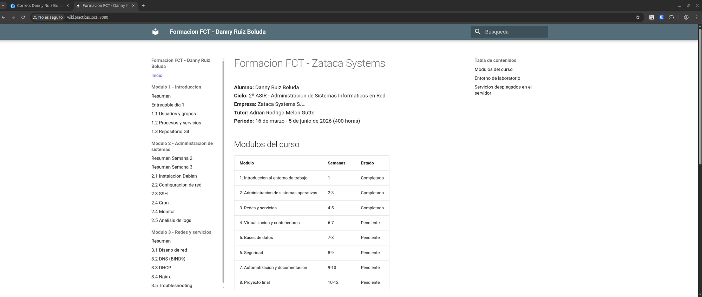

# Extra: Wiki de documentacion

## Objetivo
Montar una wiki web con toda la documentacion del curso, accesible desde el navegador via Nginx.

## Herramientas utilizadas

| Herramienta | Funcion |
|-------------|---------|
| MkDocs | Generador de sitios estaticos desde Markdown |
| mkdocs-material | Tema profesional con buscador, navegacion y responsive |
| Nginx | Servidor web que sirve la wiki |

## Instalacion de MkDocs (PC local)

```bash
pipx install mkdocs
pipx inject mkdocs mkdocs-material
```

## Configuracion (mkdocs.yml)

El fichero `mkdocs.yml` en la raiz del repositorio define:

- Nombre del sitio y autor
- Tema Material con colores personalizados
- Navegacion organizada por modulos
- Extensiones de Markdown (tablas, codigo, admonitions)

## Flujo de trabajo

1. Escribir/editar documentos .md en `docs/`
2. Generar la web: `mkdocs build`
3. Subir al servidor: `scp -r site/ soltecsis@10.160.218.20:/tmp/wiki`
4. En el servidor: `mv /tmp/wiki /var/www/wiki`

Para desarrollo local con recarga automatica:
```bash
mkdocs serve
# Abrir http://127.0.0.1:8000
```

## Configuracion Nginx

Virtual host en `/etc/nginx/sites-available/wiki`:

```nginx
server {
    listen 80;
    server_name wiki.practicas.local;
    root /var/www/wiki;
    index index.html;

    location / {
        try_files $uri $uri/ =404;
    }
}
```

Activar:
```bash
ln -s /etc/nginx/sites-available/wiki /etc/nginx/sites-enabled/
nginx -t
systemctl reload nginx
```

## Acceso

- **Desde PC local:** `http://wiki.practicas.local:8080` (via tunel SSH)
- **Dominio en /etc/hosts local:** `127.0.0.1 wiki.practicas.local`



## Resultado
- Wiki profesional con buscador, navegacion lateral y tema Material
- Toda la documentacion del curso accesible desde el navegador
- Servida por Nginx en el servidor de practicas
- Facil de actualizar: editar .md, rebuild y subir
