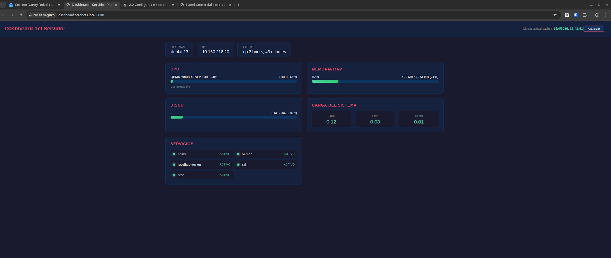

<div class="hero" markdown>

# Formación FCT - Zataca Systems

<div class="hero-subtitle">Documentación técnica del curso de Formación en Centro de Trabajo</div>

</div>

<div class="cards-grid" markdown>

<div class="card-info" markdown>
### Alumno
**Danny Ruiz Boluda**  
2º ASIR
</div>

<div class="card-info" markdown>
### Empresa
**Zataca Systems S.L.**  
Tutor: Adrian Rodrigo Melon Gutte
</div>

<div class="card-info" markdown>
### Periodo
**16 marzo - 5 junio 2026**  
400 horas (12 semanas)
</div>

</div>

## Progreso del curso

<div class="progress-overview" markdown>

| | Módulo | Semanas | Estado |
|---|--------|---------|--------|
| :material-check-circle:{ .green } | 1. Introducción al entorno de trabajo | 1 | **Completado** |
| :material-check-circle:{ .green } | 2. Administración de sistemas operativos | 2-3 | **Completado** |
| :material-check-circle:{ .green } | 3. Redes y servicios | 4-5 | **Completado** |
| :material-check-circle:{ .green } | 4. Virtualización y contenedores | 6-7 | **Completado** |
| :material-circle-outline:{ .pending } | 5. Bases de datos | 7-8 | Pendiente |
| :material-circle-outline:{ .pending } | 6. Seguridad | 8-9 | Pendiente |
| :material-circle-outline:{ .pending } | 7. Automatización y documentación | 9-10 | Pendiente |
| :material-circle-outline:{ .pending } | 8. Proyecto final | 10-12 | Pendiente |

</div>

## Entorno de laboratorio

```
┌───────────────────────────────────────────┐
│            PC Local (danny)               │
│              ssh wiki                     │
└──────────────────┬────────────────────────┘
                   │ SSH tunnel :8080
         ┌─────────┴─────────┐
         │   Nodo Proxmox    │
         │   10.160.218.10   │
         │   (Practicas)     │
         └───┬───────────┬───┘
             │           │
   ┌─────────┴───┐  ┌───┴──────────┐
   │ cliente1    │  │ cliente2     │
   │ VM 1002     │  │ VM 1003      │
   │ .218.20     │  │ sin config   │
   │ SERVIDOR    │  │ CLIENTE      │
   └─────────────┘  └──────────────┘
```

| Equipo | IP | SO | Rol |
|--------|----|----|-----|
| Nodo Proxmox | 10.160.218.10 | Proxmox VE 8.4.17 | Hipervisor |
| cliente1 (VM 1002) | 10.160.218.20 | Debian 13 Trixie | Servidor |
| cliente2 (VM 1003) | Sin configurar | - | Cliente (pendiente) |

## Servicios desplegados

<div class="services-grid" markdown>

<div class="service-card" markdown>
### :material-web: Nginx
Puerto **80** — Web estática + reverse proxy
</div>

<div class="service-card" markdown>
### :material-dns: BIND9
Puerto **53** — DNS (zona practicas.local)
</div>

<div class="service-card" markdown>
### :material-ip-network: ISC DHCP
Puerto **67** — Asignación automática de IPs
</div>

<div class="service-card" markdown>
### :material-api: Node.js/Express
Puerto **3000** — API REST + Dashboard
</div>

<div class="service-card" markdown>
### :material-console: SSH
Puerto **22** — Acceso remoto securizado
</div>

<div class="service-card" markdown>
### :material-clock-outline: Cron
monitor.sh + backup-disk-usage.sh cada hora
</div>

</div>

## Proyectos extra

<div class="extras-grid" markdown>

<div class="extra-card" markdown>
### :material-book-open-variant: [Wiki de documentación](extra-wiki.md)
Esta misma web, generada con MkDocs Material y servida por Nginx en el servidor.
</div>

<div class="extra-card" markdown>
### :material-monitor-dashboard: [Dashboard de monitorización](extra-dashboard.md)
Panel web en tiempo real con CPU, RAM, disco, carga y estado de servicios.


</div>

<div class="extra-card" markdown>
### :material-rocket-launch: [Script de despliegue](extra-deploy-wiki.md)
Desplegar la wiki con un solo comando: `wiki`
</div>

</div>

---

> *"Los backups son una religión. Los restores son el milagro."*  
> — fortune cookie de sysadmin
