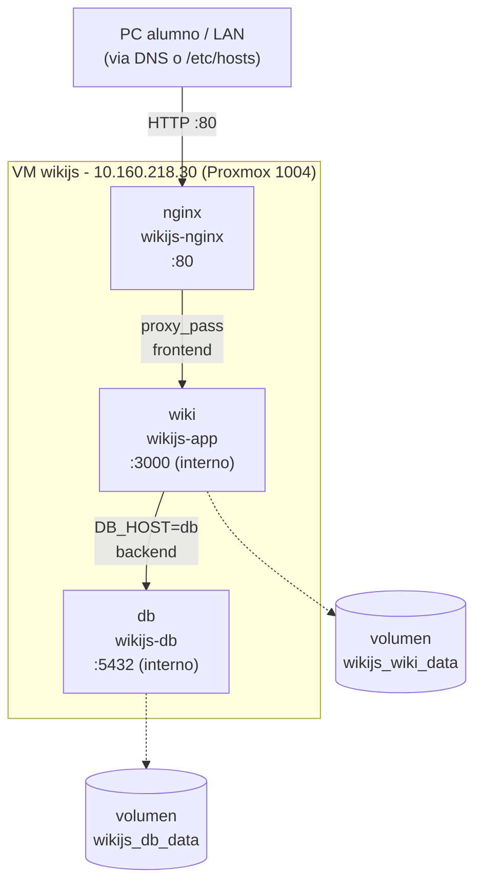

# Modulo 8 - Arquitectura del proyecto final

Documentacion tecnica del despliegue de **Wiki.js** sobre Docker en la VM
`wikijs` (Proxmox 1004). Este documento describe **lo que realmente se
construyo** en la Fase 2; el boceto inicial esta en la
[planificacion (Fase 1)](modulo8-planificacion.md) y difiere en algunos
detalles que se refinaron durante la implementacion.

## Vision general

El objetivo era desplegar un servicio web completo en contenedores aplicando
todo lo de los modulos 1-7: una VM nueva en Proxmox, Linux endurecido, red
interna con DNS propio, un stack Docker Compose de tres servicios, copias de
seguridad automaticas y monitorizacion.

La aplicacion elegida fue **Wiki.js 2** (Node.js + PostgreSQL): reutiliza el
stack ya conocido del curso y cumple de forma natural los tres servicios
minimos (app + base de datos + reverse proxy).

## Diagrama del sistema



**Decision clave de seguridad de red**: solo `nginx` publica un puerto al host
(`80:80`). `wiki` y `db` no exponen ningun puerto: solo se alcanzan a traves de
las redes internas de Docker Compose. La superficie de ataque se reduce a una
unica puerta de entrada.

## La maquina virtual

| Parametro | Valor | Nota |
|---|---|---|
| ID VM | 1004 | Clon de la plantilla `debian13` (1001). |
| Hostname | `wikijs` | Descriptivo. |
| SO | Debian 13 Trixie | Misma version que el resto del lab. |
| vCPU | 2 (`qemu64`) | **Sin VT-x** (`kvm: 0`): nada de virtualizacion anidada. |
| RAM | 2 GB | Wiki.js ~250 MB + Postgres ~150 MB + holgura. |
| Disco | 16 GB | OS + imagenes Docker + BD + uploads. |
| IP | `10.160.218.30/24` estatica | Fuera del pool DHCP. |
| Gateway | `10.160.218.1` | Default gateway del lab. |
| DNS | `10.160.218.20` (cliente1) | BIND9 del Modulo 3. |

!!! warning "qemu64 sin VT-x"
    La VM no tiene aceleracion por hardware (`cpu: qemu64`, `kvm: 0`). Los
    `docker pull`/`build` pesados son lentos y hubo un *soft lockup* puntual
    durante el setup. Por eso las imagenes se cargan precompiladas y el stack
    se mantiene ligero.

## El stack Docker Compose

Tres servicios en dos redes bridge, definidos en `/opt/wikijs/docker-compose.yml`.

| Servicio | Contenedor | Imagen | Redes | Puerto al host |
|---|---|---|---|---|
| `db` | `wikijs-db` | `postgres:17-alpine` | `backend` | ninguno |
| `wiki` | `wikijs-app` | `requarks/wiki:2` | `backend`, `frontend` | ninguno |
| `nginx` | `wikijs-nginx` | `nginx:1.27-alpine` | `frontend` | `80:80` |

### Por que dos redes (`backend` y `frontend`)

En lugar de una unica red plana, el stack separa:

- **`backend`**: solo `db` y `wiki`. Es donde viaja el trafico PostgreSQL
  (`wiki` -> `db:5432`). `nginx` **no** esta en esta red, asi que no tiene ni
  ruta hacia la base de datos.
- **`frontend`**: solo `nginx` y `wiki`. Es por donde `nginx` hace `proxy_pass`
  a `wiki:3000`. `db` **no** esta aqui.

Asi `db` queda completamente aislada del reverse proxy: un compromiso de nginx
no da acceso de red directo a la base de datos.

### Volumenes nombrados

| Volumen | Montado en | Contenido |
|---|---|---|
| `wikijs_db_data` | `db:/var/lib/postgresql/data` | Toda la wiki (paginas, usuarios, config). |
| `wikijs_wiki_data` | `wiki:/wiki/data` | `uploads/`, `content/`, `cache/`. |

!!! note "Donde vive el contenido"
    En Wiki.js 2 con backend PostgreSQL, **casi todo** (paginas, usuarios,
    ajustes) vive en la **base de datos**, no en el volumen del wiki. El
    volumen `wiki_data` guarda principalmente assets subidos y cache. Por eso
    el backup de la BD es el critico.

### Dependencias y arranque ordenado

```yaml
wiki:
  depends_on:
    db:
      condition: service_healthy   # espera a que postgres acepte conexiones
nginx:
  depends_on:
    wiki:
      condition: service_started    # solo espera a que el contenedor arranque
```

- `wiki` no arranca hasta que `db` pasa su healthcheck (`pg_isready`).
- `nginx` arranca en cuanto `wiki` existe (no espera a `service_healthy`; ver
  la nota del healthcheck en [troubleshooting](modulo8-troubleshooting.md)).

### Healthchecks

| Servicio | Test | Notas |
|---|---|---|
| `db` | `pg_isready -U $POSTGRES_USER -d $POSTGRES_DB` | interval 10s. |
| `wiki` | `wget -q --spider http://127.0.0.1:3000/` | `start_period 90s`. **127.0.0.1, no `localhost`** (ver troubleshooting). |
| `nginx` | — | sin healthcheck. |

## Red y DNS interno

En el BIND9 de cliente1 (`/etc/bind/db.practicas.local`) se anyadio:

```dns
wikijs       IN  A   10.160.218.30
```

Asi `http://wikijs.practicas.local` resuelve desde cliente1, la propia VM y el
PC del alumno. El PC usa `systemd-resolved` (apunta a `127.0.0.53`, no al
BIND), por eso en el PC se uso una entrada en `/etc/hosts` como fallback.

## Seguridad (resumen)

Replica el patron del Modulo 6, adaptado a la nueva VM. El detalle de la
configuracion esta en la [guia de instalacion](modulo8-instalacion.md#3-seguridad).

| Capa | Configuracion |
|---|---|
| Acceso | Usuario `danny` + sudo. Login **solo por clave SSH**. |
| SSH | drop-in `99-hardening.conf`: `PermitRootLogin no`, `PasswordAuthentication no`, `PubkeyAuthentication yes`. |
| Firewall | UFW `deny incoming` + allow `22`, `80`, `443/tcp`. |
| Fail2Ban | jail `sshd`, `banaction=ufw`, `backend=systemd`, bantime 1h, maxretry 5. |
| Docker | `db` y `wiki` sin puerto al host; solo `nginx` en `80:80`. |
| Secretos | `POSTGRES_PASSWORD` en `.env` con `chmod 600`, fuera del repo. |

## Mapa de ficheros en la VM

```
/opt/wikijs/
├── docker-compose.yml        # propiedad de danny, 664
├── .env                      # propiedad de root, 600 (secretos)
├── nginx/
│   └── default.conf          # vhost reverse proxy -> wiki:3000
└── backups/                  # propiedad de danny
    ├── backup-wikijs.sh
    ├── monitor-wikijs.sh
    ├── wikijs.cron
    ├── backup.log
    ├── monitor.log
    ├── db-AAAAMMDD-HHMM.sql.gz
    └── wiki_data-AAAAMMDD-HHMM.tar.gz
```

## Repositorios

| Repo | Contenido |
|---|---|
| [`wikijs-zataca`](https://github.com/DannyRuizB/wikijs-zataca) | Codigo desplegable: compose, nginx, `.env.example`, scripts, README. |
| [`formacion-danny`](https://github.com/DannyRuizB/formacion-danny) | Esta documentacion (wiki MkDocs del curso). |

El `.env` real **nunca** se sube: el repo solo lleva `.env.example` con
placeholders.

## Cumplimiento de los criterios de evaluacion

| Criterio | Como se cumple |
|---|---|
| Funcionalidad | Wiki operativa en dominio interno, datos persistentes, `restart: unless-stopped`. |
| Seguridad | SSH solo-clave, root off, UFW, Fail2Ban, secretos 600, contenedores sin puertos de mas. |
| Automatizacion | Backups con cron + retencion, monitor en cron, healthchecks, restart policies. |
| Docker | Compose con 3 servicios, 2 redes internas, volumenes nombrados, healthchecks, `depends_on: service_healthy`. |
| Documentacion | Esta wiki + README del repo + slides + demo. |
